# Analysis of Hospital Mortality with Clinical Data


## Description

This project analyzes hospital patient data to explore clinical patterns
associated with mortality using R. The data were obtained from
PhysioNet’s public MIMIC-IV Clinical Database Demo \[1\].

This pipeline includes the following stages:

\- **Preprocessing** data: cleaning, creating derived variables ,and
including them in the patients’ file (patients_mod1).

\- **Exploratory data analysis (EDA)**: Visualization with ggplot to
study the relationship among variables (categorical/continuous) and
mortality.

\- **Non-supervised analysis**: Performing clustering analysis (k-means
and hierarchical with Gower distance) to explore clinical patterns
related with mortality.

## Preprocessing

Load packages

``` r
library(tidyverse)
library(knitr)
```

Import R files

``` r
admissions <- read_csv("data/admissions.csv") |> mutate(subject_id = as.character(subject_id))
patients <- read_csv("data/patients.csv") |>  mutate(subject_id = as.character(subject_id))
```

Calculate the number of admissions

``` r
unique_admissions <- count(admissions, subject_id)
patients_mod1 <- full_join(patients, unique_admissions, by = "subject_id") |> rename(number_admissions = n) 
```

``` r
kable(head(patients_mod1, n = 10))
```

| subject_id | gender | anchor_age | anchor_year | anchor_year_group | dod | number_admissions |
|:---|:---|---:|---:|:---|:---|---:|
| 10014729 | F | 21 | 2125 | 2011 - 2013 | NA | 2 |
| 10003400 | F | 72 | 2134 | 2011 - 2013 | 2137-09-02 | 7 |
| 10002428 | F | 80 | 2155 | 2011 - 2013 | NA | 7 |
| 10032725 | F | 38 | 2143 | 2011 - 2013 | 2143-03-30 | 2 |
| 10027445 | F | 48 | 2142 | 2011 - 2013 | 2146-02-09 | 3 |
| 10037928 | F | 78 | 2175 | 2011 - 2013 | NA | 10 |
| 10001725 | F | 46 | 2110 | 2011 - 2013 | NA | 1 |
| 10040025 | F | 64 | 2143 | 2011 - 2013 | 2148-02-07 | 10 |
| 10008454 | F | 26 | 2110 | 2011 - 2013 | NA | 1 |
| 10020640 | F | 91 | 2153 | 2011 - 2013 | 2154-02-04 | 1 |

Promedio del tiempo de permanencia y tiempo total de permanencia por
paciente (cálculo en horas)

``` r
admissions_mod <- mutate(admissions, length_of_stay = dischtime -  admittime, .after= dischtime) 
```

``` r
stay <- group_by(admissions_mod, subject_id) |> 
  summarise(total_stay_h = as.numeric(sum(length_of_stay)), avg_stay_h= as.numeric(mean(length_of_stay))) 
```

``` r
patients_mod1 <- full_join(patients_mod1, stay, by= "subject_id")
```

Convert mortality to 0 and 1

``` r
patients_mod1 <- mutate(patients_mod1, patients_death = ifelse(is.na(dod), 0, 1), .after = dod)
```

Obtain the most frequent admission type. Group by ID and count the
admission type.

``` r
most_freq_admission <- count(admissions,subject_id, admission_type)
kable(head(most_freq_admission))
```

| subject_id | admission_type |   n |
|:-----------|:---------------|----:|
| 10000032   | EW EMER.       |   3 |
| 10000032   | URGENT         |   1 |
| 10001217   | DIRECT EMER.   |   1 |
| 10001217   | EW EMER.       |   1 |
| 10001725   | EW EMER.       |   1 |
| 10002428   | EU OBSERVATION |   3 |

Reorganize the table

``` r
most_freq_admission <- arrange(most_freq_admission, subject_id, desc(n))
```

Group by subject_id and extract the first row in each group.

``` r
adm <- group_by(most_freq_admission, subject_id) |> slice_head(n = 1) 
adm <- rename(adm,admissions_n = n)
kable(head(adm))
```

| subject_id | admission_type | admissions_n |
|:-----------|:---------------|-------------:|
| 10000032   | EW EMER.       |            3 |
| 10001217   | DIRECT EMER.   |            1 |
| 10001725   | EW EMER.       |            1 |
| 10002428   | EU OBSERVATION |            3 |
| 10002495   | URGENT         |            1 |
| 10002930   | EU OBSERVATION |            7 |

Modify patients_mod1 including admission and n as well.

``` r
patients_mod1 <- full_join(patients_mod1, adm, by = "subject_id")
```

Calculate the most frequent insurance per patient.

``` r
subject_insurance_count <- count(admissions,subject_id, insurance) |> 
  rename(insurance_count = n)
```

If there is a tie, I keep only one subject_id -\> with_ties = FALSE

``` r
mfi_per_patient <- group_by(subject_insurance_count, subject_id) |>
  slice_max(order_by = insurance_count, n = 1, with_ties = FALSE)
```

``` r
patients_mod1 <- full_join(patients_mod1,mfi_per_patient, by="subject_id")
```

Which patients were readmitted within the first 30 days after discharge?

``` r
adm_relag <- arrange(admissions, subject_id, admittime) |> 
  group_by(subject_id) |> 
  mutate(discharge_time = lag(dischtime), .after = dischtime)
```

``` r
adm_mod3 <- mutate(adm_relag, days_between = as.numeric(admittime - discharge_time), .after = discharge_time) |> 
  filter(days_between <= 30)
kable(head(adm_mod3)) 
```

| subject_id | hadm_id | admittime | dischtime | discharge_time | days_between | deathtime | admission_type | admit_provider_id | admission_location | discharge_location | insurance | language | marital_status | race | edregtime | edouttime | hospital_expire_flag |
|:---|---:|:---|:---|:---|---:|:---|:---|:---|:---|:---|:---|:---|:---|:---|:---|:---|---:|
| 10000032 | 29079034 | 2180-07-23 12:35:00 | 2180-07-25 17:55:00 | 2180-06-27 18:49:00 | 25.740278 | NA | EW EMER. | P30KEH | EMERGENCY ROOM | HOME | Medicaid | ENGLISH | WIDOWED | WHITE | 2180-07-23 05:54:00 | 2180-07-23 14:00:00 | 0 |
| 10000032 | 25742920 | 2180-08-05 23:44:00 | 2180-08-07 17:50:00 | 2180-07-25 17:55:00 | 11.242361 | NA | EW EMER. | P60CC5 | EMERGENCY ROOM | HOSPICE | Medicaid | ENGLISH | WIDOWED | WHITE | 2180-08-05 20:58:00 | 2180-08-06 01:44:00 | 0 |
| 10001217 | 27703517 | 2157-12-18 16:58:00 | 2157-12-24 14:55:00 | 2157-11-25 18:00:00 | 22.956944 | NA | DIRECT EMER. | P99698 | PHYSICIAN REFERRAL | HOME HEALTH CARE | Other | ? | MARRIED | WHITE | NA | NA | 0 |
| 10002428 | 20321825 | 2156-04-30 20:35:00 | 2156-05-03 16:36:00 | 2156-04-29 16:26:00 | 1.172917 | NA | EW EMER. | P825SO | EMERGENCY ROOM | CHRONIC/LONG TERM ACUTE CARE | Medicare | ENGLISH | WIDOWED | WHITE | 2156-04-30 18:30:00 | 2156-04-30 21:53:00 | 0 |
| 10002428 | 23473524 | 2156-05-11 14:49:00 | 2156-05-22 14:16:00 | 2156-05-03 16:36:00 | 7.925694 | NA | EW EMER. | P3529J | EMERGENCY ROOM | CHRONIC/LONG TERM ACUTE CARE | Medicare | ENGLISH | WIDOWED | WHITE | 2156-05-11 11:29:00 | 2156-05-11 16:53:00 | 0 |
| 10002930 | 28301173 | 2197-04-08 19:37:00 | 2197-04-15 12:01:00 | 2197-04-08 19:37:00 | 0.000000 | NA | URGENT | P3763P | INTERNAL TRANSFER TO OR FROM PSYCH | HOME | Medicare | ENGLISH | SINGLE | BLACK/AFRICAN AMERICAN | NA | NA | 0 |

How many times were the readmitted ?

``` r
readm_number = count(adm_mod3, subject_id) |> 
  rename(n_readm_30_days = n)

patients_mod1 <- full_join(patients_mod1,readm_number, by = "subject_id")

patients_mod1 <- mutate(patients_mod1, n_readm_30_days = ifelse(is.na(n_readm_30_days), 0,n_readm_30_days))

patients_mod1 <- mutate(patients_mod1, readm_30_days = ifelse(n_readm_30_days == 0, 0, 1))
```

I introduce the variable ethnicity into patients_mod1

``` r
ethnicity_count <-count(admissions, subject_id, race)
kable(head(ethnicity_count))
```

| subject_id | race                   |   n |
|:-----------|:-----------------------|----:|
| 10000032   | WHITE                  |   4 |
| 10001217   | WHITE                  |   2 |
| 10001725   | WHITE                  |   1 |
| 10002428   | WHITE                  |   7 |
| 10002495   | UNKNOWN                |   1 |
| 10002930   | BLACK/AFRICAN AMERICAN |  12 |

The resulting table has a dimension of 104 x 3, this is because for the
same patient there are different classifications. Example:

``` r
kable(head(filter(ethnicity_count, subject_id ==10004457)))
```

| subject_id | race  |   n |
|:-----------|:------|----:|
| 10004457   | OTHER |   1 |
| 10004457   | WHITE |   5 |

I create a new logical column to identify which values are duplicated.

``` r
ethnicity_count <-mutate(ethnicity_count, duplicated_var = duplicated(ethnicity_count$subject_id))
kable(head(ethnicity_count))
```

| subject_id | race                   |   n | duplicated_var |
|:-----------|:-----------------------|----:|:---------------|
| 10000032   | WHITE                  |   4 | FALSE          |
| 10001217   | WHITE                  |   2 | FALSE          |
| 10001725   | WHITE                  |   1 | FALSE          |
| 10002428   | WHITE                  |   7 | FALSE          |
| 10002495   | UNKNOWN                |   1 | FALSE          |
| 10002930   | BLACK/AFRICAN AMERICAN |  12 | FALSE          |

I filter those that are TRUE.

``` r
ethnicity_repeated <- filter(ethnicity_count, duplicated_var == TRUE)
kable(head(ethnicity_repeated))
```

| subject_id | race                    |   n | duplicated_var |
|:-----------|:------------------------|----:|:---------------|
| 10004457   | WHITE                   |   5 | TRUE           |
| 10035631   | WHITE                   |   6 | TRUE           |
| 10037928   | HISPANIC/LATINO - CUBAN |   9 | TRUE           |
| 10038992   | WHITE                   |   1 | TRUE           |

Now I filter out the FALSE values and keep the table of 100 rows, which
I will join to patients_mod1.

``` r
ethnicity_count <- filter(ethnicity_count, duplicated_var != TRUE)
kable(head(ethnicity_count))
```

| subject_id | race                   |   n | duplicated_var |
|:-----------|:-----------------------|----:|:---------------|
| 10000032   | WHITE                  |   4 | FALSE          |
| 10001217   | WHITE                  |   2 | FALSE          |
| 10001725   | WHITE                  |   1 | FALSE          |
| 10002428   | WHITE                  |   7 | FALSE          |
| 10002495   | UNKNOWN                |   1 | FALSE          |
| 10002930   | BLACK/AFRICAN AMERICAN |  12 | FALSE          |

Before joining the tables, I modify the data of the subject_id present
in ethnicity_count with those obtained from ethnicity_repeated.

``` r
ethnicity_count <- mutate(ethnicity_count, race = case_when(subject_id == 10004457 ~ "WHITE",
  subject_id == 10035631 ~ "WHITE",
  subject_id == 10037928 ~ "HISPANIC/LATINO - CUBAN",
  subject_id == 10038992 ~ "WHITE", 
  .default = race))
kable(head(ethnicity_count))
```

| subject_id | race                   |   n | duplicated_var |
|:-----------|:-----------------------|----:|:---------------|
| 10000032   | WHITE                  |   4 | FALSE          |
| 10001217   | WHITE                  |   2 | FALSE          |
| 10001725   | WHITE                  |   1 | FALSE          |
| 10002428   | WHITE                  |   7 | FALSE          |
| 10002495   | UNKNOWN                |   1 | FALSE          |
| 10002930   | BLACK/AFRICAN AMERICAN |  12 | FALSE          |

I check that it has been replaced correctly.

``` r
kable(filter(ethnicity_count, subject_id == 10004457 | subject_id == 10035631 | subject_id == 10037928 | subject_id == 10038992))
```

| subject_id | race                    |   n | duplicated_var |
|:-----------|:------------------------|----:|:---------------|
| 10004457   | WHITE                   |   1 | FALSE          |
| 10035631   | WHITE                   |   3 | FALSE          |
| 10037928   | HISPANIC/LATINO - CUBAN |   1 | FALSE          |
| 10038992   | WHITE                   |   1 | FALSE          |

n Join with the patients_mod1 table.

``` r
patients_mod1 <- select(ethnicity_count, subject_id, race) |> 
  full_join(patients_mod1, ethnicity_count, by = "subject_id")
kable(head(patients_mod1))
```

| subject_id | race | gender | anchor_age | anchor_year | anchor_year_group | dod | patients_death | number_admissions | total_stay_h | avg_stay_h | admission_type | admissions_n | insurance | insurance_count | n_readm_30_days | readm_30_days |
|:---|:---|:---|---:|---:|:---|:---|---:|---:|---:|---:|:---|---:|:---|---:|---:|---:|
| 10000032 | WHITE | F | 52 | 2180 | 2014 - 2016 | 2180-09-09 | 1 | 4 | 138.66667 | 34.66667 | EW EMER. | 3 | Medicaid | 3 | 2 | 1 |
| 10001217 | WHITE | F | 55 | 2157 | 2011 - 2013 | NA | 0 | 2 | 305.01667 | 152.50833 | DIRECT EMER. | 1 | Other | 2 | 1 | 1 |
| 10001725 | WHITE | F | 46 | 2110 | 2011 - 2013 | NA | 0 | 1 | 71.86667 | 71.86667 | EW EMER. | 1 | Other | 1 | 0 | 0 |
| 10002428 | WHITE | F | 80 | 2155 | 2011 - 2013 | NA | 0 | 7 | 944.36667 | 134.90952 | EU OBSERVATION | 3 | Medicare | 7 | 2 | 1 |
| 10002495 | UNKNOWN | M | 81 | 2141 | 2014 - 2016 | NA | 0 | 1 | 165.40000 | 165.40000 | URGENT | 1 | Medicare | 1 | 0 | 0 |
| 10002930 | BLACK/AFRICAN AMERICAN | F | 48 | 2193 | 2011 - 2013 | 2201-12-24 | 1 | 12 | 958.43333 | 79.86944 | EU OBSERVATION | 7 | Medicare | 12 | 1 | 1 |

## Exploratory Data Analysis (EDA)

### Categorical Variables vs. Death Outcome.

**Proportion of deaths by insurance.**

``` r
ggplot(patients_mod1, mapping = aes(y = factor(patients_death), fill = insurance)) +
  geom_bar() +
  scale_fill_manual(values = c("Medicaid" = "steelblue",
 "Medicare" = "darkorange", 
 "Other" = "#76B7B2"),
name = "0 Alive 
1 Death") +
  theme_light() +
  labs(title = "Counts of deaths by insurance") +
  scale_x_continuous(breaks =seq(0,70, by=5))+
  coord_flip()
```

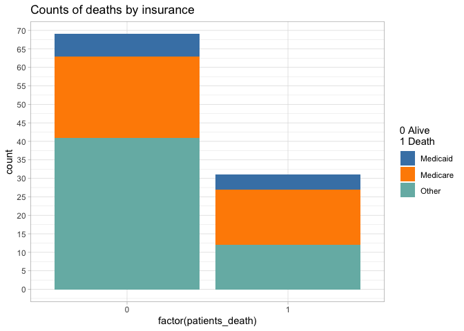

**Proportion of deaths by gender.**

``` r
ggplot(patients_mod1, aes(y=factor(patients_death), fill = gender)) +
  geom_bar(position = "dodge") +
  scale_fill_manual(values = c("F" = "lightpink", "M"="lightblue")) +
  labs(title = "Count of deaths by gender",
y = "") +
  scale_x_continuous(breaks = seq(0,50, by= 5)) +
  theme_light() +
  coord_flip() 
```


Different names are used to refer to the same variable values. For
example: “UNKNOWN, UNABLE TO OBTAIN, OTHER…” I recoded the variable race
to group similar categories under a single label.

``` r
patients_mod1 <- mutate(patients_mod1, race = case_when(race %in% c("HISPANIC OR LATINO", "HISPANIC/LATINO - CUBAN",  "HISPANIC/LATINO - PUERTO RICAN", "HISPANIC/LATINO - SALVADORAN") ~ "LATINO",  
race %in% c("BLACK/AFRICAN AMERICAN","BLACK/CAPE VERDEAN", "BLACK") ~ "BLACK",
race %in% c("WHITE - BRAZILIAN", "WHITE - OTHER EUROPEAN", "WHITE", "PORTUGUESE")~ "WHITE",
race %in% c("UNKNOWN","UNABLE TO OBTAIN","OTHER", "PATIENT DECLINED TO ANSWER") ~ "OTHER", .default= race))
```

**Proportion of deaths by race.**

``` r
ggplot(patients_mod1,aes(y= factor(patients_death), fill = race)) +
  geom_bar(position = "dodge") +
  scale_fill_manual(values=c("BLACK" = "turquoise", "OTHER" = "lightgray", "WHITE" = "skyblue", "LATINO"="salmon"),
name = "0 Alive 1 Death
Race") +
  theme_light() +
  scale_linetype_binned() +
  scale_x_continuous(breaks = seq(0, 70, by=5)) +
  coord_flip() +
  labs(title = "Count of deaths according to race",
y = "")
```

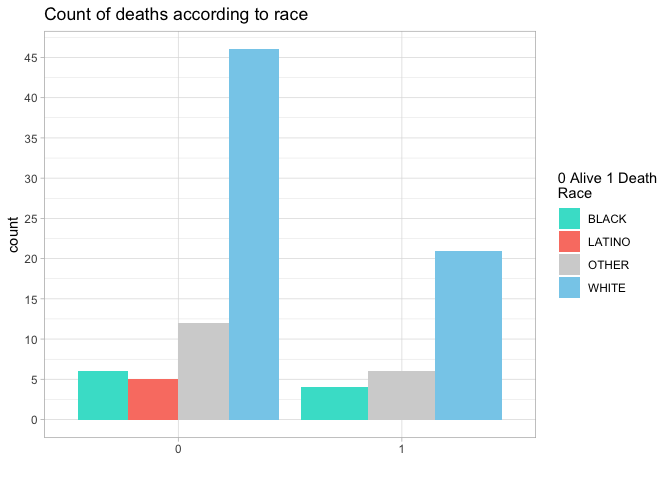

**Proportion of deaths by admission type.**

``` r
ggplot(patients_mod1, aes(y=factor(patients_death), fill =admission_type)) +
  geom_bar(position = "dodge") +
  coord_flip() +
  theme_classic() +
  theme(legend.text= element_text(size = 5),
legend.title= element_text(size = 8)) +
  scale_x_continuous(breaks = seq(0,30, by=2)) +
  labs(title = "Death vs adm.type") +
   scale_fill_brewer(palette="Set3") 
```

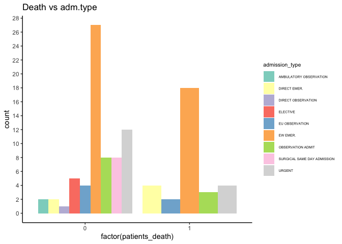

### Quantitative Variables vs Death Outcome.

**Average length of stay (hours) by death outcome**

``` r
deaths_vs_stay <- group_by(patients_mod1, patients_death) |> 
  summarise(media = mean(avg_stay_h),desv = sd(avg_stay_h, na.rm = TRUE), 
n = n())
```

``` r
deaths_vs_stay <- mutate(deaths_vs_stay, est_error = desv/sqrt(n),
upper_bound_ci = media + qt(0.975, df = n - 1) * est_error, 
lower_bound_ci = media - qt(0.975, df = n - 1) * est_error)
```

``` r
ggplot(deaths_vs_stay, aes(x = factor(patients_death), y=media)) +
  geom_col(fill = "skyblue") +
  geom_errorbar(aes(ymin= media - desv, ymax= media + desv), width = 0.2) +
  xlab("Death outcome") +
  ylab("Mean") +
  theme_minimal() 
```

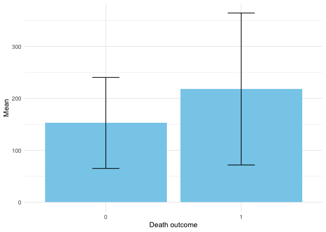

**Number of readmissions within the first 30 days by death outcome**

``` r
ggplot(patients_mod1, aes(y = factor(patients_death), fill = factor(n_readm_30_days))) +
  geom_bar(position = "dodge") +
  labs(y="", fill = "Number of readmissions") +
  theme_minimal() +
  ggtitle("Number of readmissions within first 30 days") +
  scale_x_continuous(breaks = seq(0,100,by= 5)) +
  theme(legend.text= element_text(size = 9), legend.position="bottom", 
legend.title.position = "top") +
  guides(fill=guide_legend(nrow = 1)) +
  scale_fill_manual(values = c("red", "blue", "green", "grey", "pink", "purple"))
```

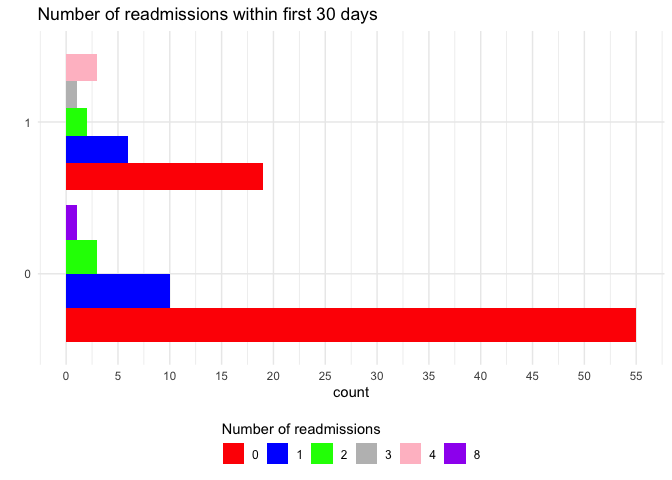

**Average stay (hours) and number of admissions by death outcome**

``` r
ggplot(patients_mod1, aes(x= avg_stay_h, y =number_admissions, color=factor(patients_death))) +
  geom_point() +
  theme_light() +
  ylab("Number of admissions") +
  xlab("Average of stay (hours)") +
  ggtitle("Average Hospital Stay vs. Number of Admissions, by Death Outcome") +
  scale_x_continuous(breaks = seq(0,800, by= 100)) +
  scale_y_continuous(breaks= seq(0,25, by= 2)) +
  scale_color_manual(name = "Status", values = c("0" = "grey", "1"="turquoise"), labels = c("0" = "0 Alive", "1" = "1 Death"))
```

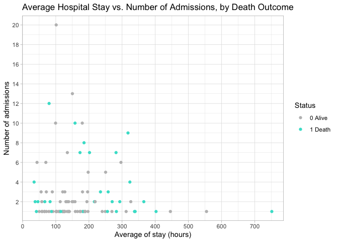

**Readmissions within 30 days vs number of admissions by death outcome**

Selection: 1

``` r
ggplot(patients_mod1, aes(y=n_readm_30_days, x =number_admissions, color = factor(patients_death))) +
  geom_point()+
  ylab("Readmissions within 30 d.") +
  xlab("Number of admissions") +
  theme_minimal() +
  scale_color_manual(values=c("0" = "salmon", "1" = "lightgrey")) +
  scale_y_continuous(breaks = seq(-30, 30, by= 5)) +
  ggtitle("Relationship Between Admissions 
and 30-Day Readmissions (Alive vs Dead)")
```

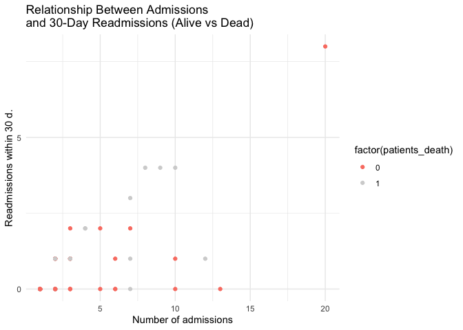

**Hospital stay vs 30-day readmissions by survival**

``` r
ggplot(patients_mod1, aes(y = total_stay_h, x = n_readm_30_days ,color = factor(patients_death))) +
  geom_point() +
  labs(title = "Hospital Stay vs. 30-Day Readmissions 
by Survival Status", x = "Readmissions within 30 days", y = "Total stay in hours", color = "Patients death") +
  theme_minimal() 
```

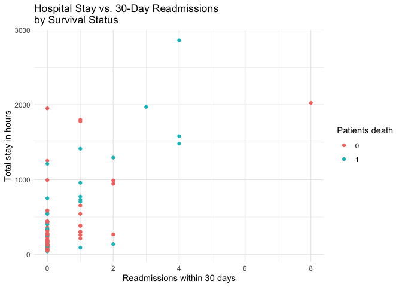

**Number of admissions by admission type and death outcome**

``` r
ggplot(patients_mod1, aes(x = admissions_n, fill = admission_type)) +
  geom_bar()+
  facet_wrap(~patients_death) +
  scale_fill_brewer(palette= "Set3") +
  theme_minimal() +
  labs(x = "Number of admissions", title = "Admissions by Type and Outcome", fill = "") +
   theme(legend.text= element_text(size = 5))
```

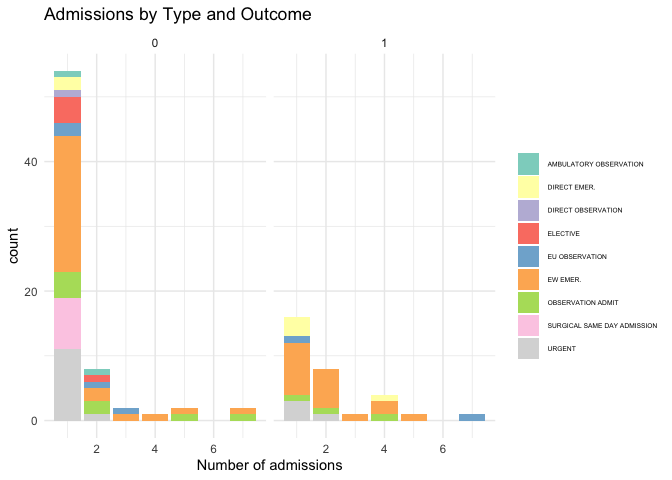

## **Non-supervised analysis.**

### Clustering quantitative variables.

Patient clustering: selection of relevant variables. Eliminate
categorical (character) variables.

``` r
patients_mod2 <- select(patients_mod1, -c(subject_id,insurance,gender,anchor_year ,anchor_year_group, dod,
patients_death, race, readm_30_days, admission_type))
```

Visualize the data

``` r
summary(patients_mod2)
```

       anchor_age    number_admissions  total_stay_h       avg_stay_h    
     Min.   :21.00   Min.   : 1.00     Min.   :  41.68   Min.   : 34.67  
     1st Qu.:51.75   1st Qu.: 1.00     1st Qu.: 124.33   1st Qu.:102.09  
     Median :63.00   Median : 1.00     Median : 244.72   Median :140.34  
     Mean   :61.75   Mean   : 2.75     Mean   : 453.79   Mean   :172.94  
     3rd Qu.:72.00   3rd Qu.: 3.00     3rd Qu.: 540.56   3rd Qu.:216.75  
     Max.   :91.00   Max.   :20.00     Max.   :2859.72   Max.   :751.38  
      admissions_n  insurance_count n_readm_30_days
     Min.   :1.00   Min.   : 1.0    Min.   :0.00   
     1st Qu.:1.00   1st Qu.: 1.0    1st Qu.:0.00   
     Median :1.00   Median : 1.0    Median :0.00   
     Mean   :1.67   Mean   : 2.7    Mean   :0.49   
     3rd Qu.:2.00   3rd Qu.: 3.0    3rd Qu.:1.00   
     Max.   :7.00   Max.   :20.0    Max.   :8.00   

Standardization.

``` r
patients_scale <- scale(patients_mod2)
summary(patients_scale)
```

       anchor_age      number_admissions   total_stay_h       avg_stay_h     
     Min.   :-2.5201   Min.   :-0.55042   Min.   :-0.7630   Min.   :-1.2278  
     1st Qu.:-0.6184   1st Qu.:-0.55042   1st Qu.:-0.6100   1st Qu.:-0.6291  
     Median : 0.0773   Median :-0.55042   Median :-0.3871   Median :-0.2895  
     Mean   : 0.0000   Mean   : 0.00000   Mean   : 0.0000   Mean   : 0.0000  
     3rd Qu.: 0.6339   3rd Qu.: 0.07863   3rd Qu.: 0.1607   3rd Qu.: 0.3890  
     Max.   : 1.8089   Max.   : 5.42555   Max.   : 4.4544   Max.   : 5.1362  
      admissions_n     insurance_count    n_readm_30_days  
     Min.   :-0.4913   Min.   :-0.53840   Min.   :-0.4228  
     1st Qu.:-0.4913   1st Qu.:-0.53840   1st Qu.:-0.4228  
     Median :-0.4913   Median :-0.53840   Median :-0.4228  
     Mean   : 0.0000   Mean   : 0.00000   Mean   : 0.0000  
     3rd Qu.: 0.2420   3rd Qu.: 0.09501   3rd Qu.: 0.4400  
     Max.   : 3.9085   Max.   : 5.47905   Max.   : 6.4796  

Set the optimal number of clusters.

``` r
library(factoextra)
```

``` r
fviz_nbclust(patients_scale, FUNcluster = kmeans, method = "wss")
```

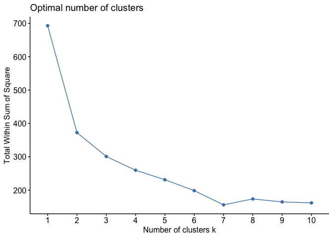

Optimal k = 3.

``` r
cluster_patients <- kmeans(patients_scale, centers = 3)
vector_cluster <- cluster_patients$cluster
patients_mod1 <- mutate(patients_mod1, clusters_patients = vector_cluster)
```

Patient clusters by number of admissions and average hospital stay.

``` r
ggplot(patients_mod1, aes(y=avg_stay_h, x =number_admissions, color = factor(clusters_patients))) +
  geom_point() +
  xlab("Number of admissions") +
  ylab("Average of stay (hours) ") +
  ggtitle("Patient clustering by admissions 
and 30-day readmissions") +
  theme_minimal() +
  scale_x_continuous(breaks= seq(0,40, by=5)) +
  scale_y_continuous(breaks = seq(0,1000, by = 50))
```

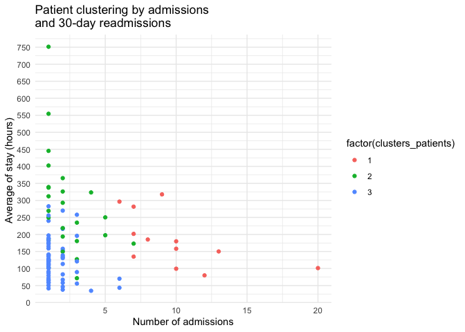

Visualization of patient clusters.

``` r
fviz_cluster(cluster_patients,patients_mod2, axes = c(1,2))
```


### Clustering including categorical variables.

``` r
library(cluster)
```

I cloned patients_mod1 to patients_mod3 in order to make some changes to
the table.

``` r
patients_mod1 <- mutate(patients_mod1, prop_insurance_count = insurance_count / number_admissions, .after = insurance_count)


patients_mod3 <- patients_mod1
```

In patients_mod3, convert character columns to factors to avoid errors
when using daisy, and remove irrelevant categorical variables.

``` r
patients_mod3 <- mutate(patients_mod3,subject_id = as.factor(subject_id), 
race = as.factor(race),
anchor_year = as.factor(anchor_year),
anchor_year_group = as.factor(anchor_year_group),
gender = as.factor(gender),
dod = as.factor(dod),
admission_type = as.factor(admission_type),
insurance = as.factor(insurance),
patients_death = as.factor(patients_death),
readm_30_days = as.factor(readm_30_days)) |>  select(-c(subject_id, anchor_year,dod, insurance_count, clusters_patients))
```

Gower distance matrix for patients.

``` r
mat <- daisy(patients_mod3, metric = "gower")
```

Hierarchical clustering of patients (complete linkage).

``` r
resultado <- hclust(mat, method = "complete")
```

Dendrogram of patients (complete-linkage clustering).

``` r
plot(resultado, cex = 0.3)
```

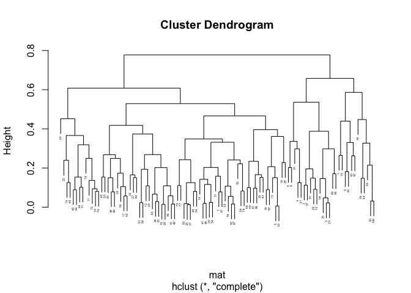

I use factoextra to determine the optimal number of clusters (k = 4).

``` r
fviz_nbclust(patients_mod3, FUN = hcut, diss = mat, method = "wss")
```

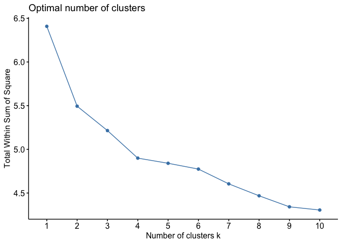

Dendrogram of patients with 4 clusters highlighted.

``` r
clust <- cutree(resultado, k = 4) 
plot (resultado, cex = 0.3)
rect.hclust(resultado, k = 4, border = 1:3)
```

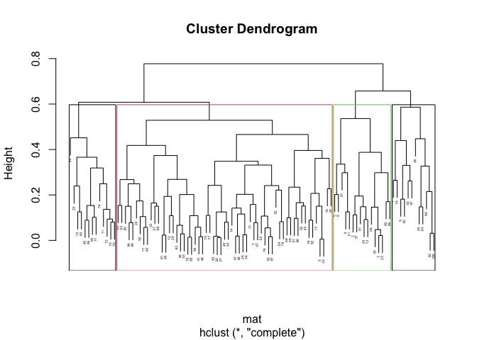

``` r
patients_mod1 <- mutate(patients_mod1, clusters_chategorical = clust)
```

\### Logistic Regression with k-Fold Cross-Validation (Caret)

In this part I have done an alysis focused on applying logistic
regression to a patient dataset, followed by model training and
evaluation using k-fold cross-validation through the caret package in R.
The goal is to predict patient mortality (patients_death) based on a set
of clinical and demographic features.

``` r
patients_mod4 <- select(patients_mod1, -c(subject_id,anchor_year,dod,insurance_count))
logistica1 <- glm(patients_death ~ . - clusters_patients - clusters_chategorical, data = patients_mod4)
summary(logistica1)
```


    Call:
    glm(formula = patients_death ~ . - clusters_patients - clusters_chategorical, 
        data = patients_mod4)

    Coefficients:
                                                Estimate Std. Error t value
    (Intercept)                                1.290e-01  7.758e-01   0.166
    raceLATINO                                -2.562e-01  2.783e-01  -0.920
    raceOTHER                                  7.728e-03  2.181e-01   0.035
    raceWHITE                                  1.013e-02  1.818e-01   0.056
    genderM                                    1.269e-01  1.017e-01   1.248
    anchor_age                                 6.209e-03  3.436e-03   1.807
    anchor_year_group2014 - 2016              -1.153e-01  1.093e-01  -1.054
    number_admissions                         -8.016e-02  5.808e-02  -1.380
    total_stay_h                               8.178e-05  2.099e-04   0.390
    avg_stay_h                                 5.703e-04  5.622e-04   1.014
    admission_typeDIRECT EMER.                 5.307e-01  4.245e-01   1.250
    admission_typeDIRECT OBSERVATION          -2.099e-02  5.751e-01  -0.036
    admission_typeELECTIVE                     4.504e-02  4.368e-01   0.103
    admission_typeEU OBSERVATION               3.667e-01  3.934e-01   0.932
    admission_typeEW EMER.                     3.002e-01  3.776e-01   0.795
    admission_typeOBSERVATION ADMIT            3.136e-01  4.103e-01   0.764
    admission_typeSURGICAL SAME DAY ADMISSION  7.907e-04  4.091e-01   0.002
    admission_typeURGENT                       2.383e-01  4.155e-01   0.574
    admissions_n                               1.579e-01  1.055e-01   1.496
    insuranceMedicare                         -3.067e-02  1.973e-01  -0.155
    insuranceOther                            -1.092e-01  1.818e-01  -0.600
    prop_insurance_count                      -6.237e-01  8.045e-01  -0.775
    n_readm_30_days                            5.306e-02  7.821e-02   0.678
    readm_30_days                              4.384e-02  1.865e-01   0.235
                                              Pr(>|t|)  
    (Intercept)                                 0.8684  
    raceLATINO                                  0.3603  
    raceOTHER                                   0.9718  
    raceWHITE                                   0.9557  
    genderM                                     0.2160  
    anchor_age                                  0.0747 .
    anchor_year_group2014 - 2016                0.2951  
    number_admissions                           0.1716  
    total_stay_h                                0.6979  
    avg_stay_h                                  0.3136  
    admission_typeDIRECT EMER.                  0.2151  
    admission_typeDIRECT OBSERVATION            0.9710  
    admission_typeELECTIVE                      0.9181  
    admission_typeEU OBSERVATION                0.3542  
    admission_typeEW EMER.                      0.4290  
    admission_typeOBSERVATION ADMIT             0.4470  
    admission_typeSURGICAL SAME DAY ADMISSION   0.9985  
    admission_typeURGENT                        0.5680  
    admissions_n                                0.1388  
    insuranceMedicare                           0.8769  
    insuranceOther                              0.5500  
    prop_insurance_count                        0.4406  
    n_readm_30_days                             0.4996  
    readm_30_days                               0.8148  
    ---
    Signif. codes:  0 '***' 0.001 '**' 0.01 '*' 0.05 '.' 0.1 ' ' 1

    (Dispersion parameter for gaussian family taken to be 0.1896728)

        Null deviance: 21.390  on 99  degrees of freedom
    Residual deviance: 14.415  on 76  degrees of freedom
    AIC: 140.1

    Number of Fisher Scoring iterations: 2

``` r
library(caret)
```

\### k-Fold Cross-Validation with Caret

The caret package is used to train the logistic model and perform 5-fold
cross-validation: Set seed

``` r
set.seed(7)
logistica1_cv <- train(as.factor(patients_death) ~ . - clusters_patients - clusters_chategorical, 
  data = patients_mod4, method = "glm", family = binomial, 
trControl= trainControl(method = "cv", number = 5))
logistica1_cv
```

    Generalized Linear Model 

    100 samples
     15 predictor
      2 classes: '0', '1' 

    No pre-processing
    Resampling: Cross-Validated (5 fold) 
    Summary of sample sizes: 81, 80, 79, 80, 80 
    Resampling results:

      Accuracy   Kappa    
      0.6511779  0.1418363

## Survival analysis

The datasets that will be used to do survival analysis are patients and
admissions respectively. Required packages: survival, survminer.
install.packages(“survival”) install.packages(“survminer”)

``` r
library(survival)
library(survminer)
```

Construct survival dataset by computing the first admission time, last
discharge time, and derived survival duration

``` r
surv <- group_by(admissions, subject_id) |> 
summarise(first_admittime = min(admittime), last_disch = max(dischtime)) |> 
  mutate(survival_days = as.numeric(last_disch - first_admittime))

surv <- select(surv, subject_id, survival_days)
```

Merge survival information into patients_mod1.

``` r
patients_mod1 <- full_join(patients_mod1,surv, by= "subject_id")
```

Fit the Kaplan–Meier estimator.

``` r
 km_fit <- survfit(Surv(survival_days, patients_death)~1, data=patients_mod1)
```

Plotting the survival curve.

``` r
ggsurvplot(km_fit)
```

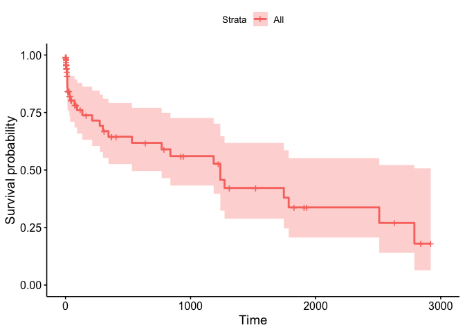

Cross markers indicate censored observations (patients exiting the study
for unspecified reasons). Drops in the curve correspond to observed
deaths. No stratification is applied because all patients are included
in a single group.

``` r
ggsurvplot(km_fit, censor = FALSE, risk.table = TRUE) 
```

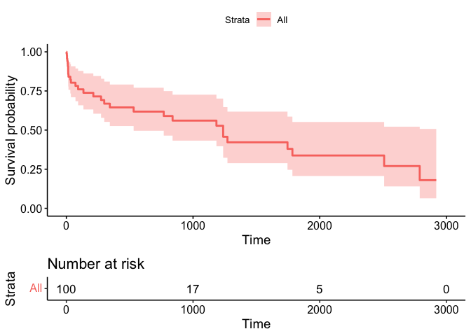

Stratified survival curves by gender, insurance and, race.

``` r
km_fit_gender <- survfit(Surv(survival_days, patients_death)~ gender, data=patients_mod1)
km_fit_gender
```

    Call: survfit(formula = Surv(survival_days, patients_death) ~ gender, 
        data = patients_mod1)

              n events median 0.95LCL 0.95UCL
    gender=F 43     11   2508    1185      NA
    gender=M 57     20    769     274      NA

``` r
ggsurvplot(km_fit_gender, risk.table = TRUE, pval = TRUE)
```

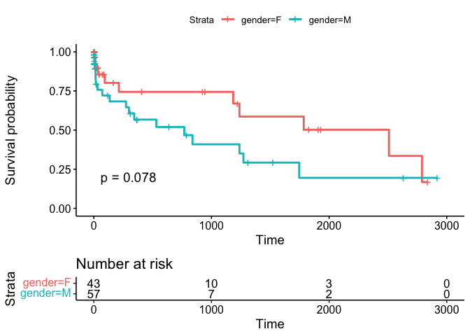

``` r
km_fit_race<- survfit(Surv(survival_days, patients_death)~ race, data=patients_mod1)
ggsurvplot(km_fit_race)
```

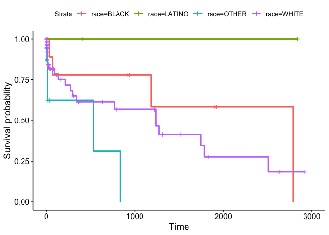

### Cox proportional hazards models

Cox proportional hazards model without covariates.

``` r
cox_fit <- coxph(Surv(survival_days, patients_death)~1, data=patients_mod1)
summary(cox_fit)
```

    Call:  coxph(formula = Surv(survival_days, patients_death) ~ 1, data = patients_mod1)

    Null model
      log likelihood= -105.2269 
      n= 100 

### Cox model with gender as predictor

``` r
cox_fit_gender <- coxph(Surv(survival_days, patients_death)~ gender, data=patients_mod1)
summary(cox_fit_gender)
```

    Call:
    coxph(formula = Surv(survival_days, patients_death) ~ gender, 
        data = patients_mod1)

      n= 100, number of events= 31 

              coef exp(coef) se(coef)     z Pr(>|z|)  
    genderM 0.6601    1.9349   0.3814 1.731   0.0835 .
    ---
    Signif. codes:  0 '***' 0.001 '**' 0.01 '*' 0.05 '.' 0.1 ' ' 1

            exp(coef) exp(-coef) lower .95 upper .95
    genderM     1.935     0.5168    0.9163     4.086

    Concordance= 0.603  (se = 0.046 )
    Likelihood ratio test= 3.14  on 1 df,   p=0.08
    Wald test            = 3  on 1 df,   p=0.08
    Score (logrank) test = 3.1  on 1 df,   p=0.08

### Cox model with race as predictor

``` r
cox_fit_race<- coxph(Surv(survival_days, patients_death)~ race, data=patients_mod1)
summary(cox_fit_race)
```

    Call:
    coxph(formula = Surv(survival_days, patients_death) ~ race, data = patients_mod1)

      n= 100, number of events= 31 

                     coef  exp(coef)   se(coef)      z Pr(>|z|)  
    raceLATINO -1.782e+01  1.826e-08  6.063e+03 -0.003   0.9977  
    raceOTHER   1.647e+00  5.193e+00  6.795e-01  2.424   0.0153 *
    raceWHITE   5.595e-01  1.750e+00  5.518e-01  1.014   0.3106  
    ---
    Signif. codes:  0 '***' 0.001 '**' 0.01 '*' 0.05 '.' 0.1 ' ' 1

               exp(coef) exp(-coef) lower .95 upper .95
    raceLATINO 1.826e-08  5.477e+07    0.0000       Inf
    raceOTHER  5.193e+00  1.926e-01    1.3709     19.67
    raceWHITE  1.750e+00  5.715e-01    0.5934      5.16

    Concordance= 0.637  (se = 0.048 )
    Likelihood ratio test= 10.64  on 3 df,   p=0.01
    Wald test            = 6.82  on 3 df,   p=0.08
    Score (logrank) test = 10.37  on 3 df,   p=0.02

``` r
count(patients_mod1,race)
```

    # A tibble: 4 × 2
      race       n
      <chr>  <int>
    1 BLACK     10
    2 LATINO     5
    3 OTHER     18
    4 WHITE     67

### Cox model with age as predictor

``` r
cox_fit_age <- coxph(Surv(survival_days, patients_death)~ anchor_age, data=patients_mod1)
summary(cox_fit_age)
```

    Call:
    coxph(formula = Surv(survival_days, patients_death) ~ anchor_age, 
        data = patients_mod1)

      n= 100, number of events= 31 

                  coef exp(coef) se(coef)     z Pr(>|z|)  
    anchor_age 0.02503   1.02535  0.01322 1.894   0.0582 .
    ---
    Signif. codes:  0 '***' 0.001 '**' 0.01 '*' 0.05 '.' 0.1 ' ' 1

               exp(coef) exp(-coef) lower .95 upper .95
    anchor_age     1.025     0.9753    0.9991     1.052

    Concordance= 0.611  (se = 0.065 )
    Likelihood ratio test= 3.73  on 1 df,   p=0.05
    Wald test            = 3.59  on 1 df,   p=0.06
    Score (logrank) test = 3.62  on 1 df,   p=0.06

In this case, the model using race as predictor exhibits the highest
concordance.

``` r
cox_fit_2<- coxph(Surv(survival_days, patients_death)~ race + anchor_age + gender + insurance, data=patients_mod1)
```

Model selection using backward stepwise elimination.

``` r
best_model <- MASS::stepAIC(cox_fit_2, direction = "backward")
```

    Start:  AIC=209.57
    Surv(survival_days, patients_death) ~ race + anchor_age + gender + 
        insurance

                 Df    AIC
    - insurance   2 205.59
    - gender      1 208.07
    <none>          209.57
    - race        3 210.29
    - anchor_age  1 210.47


    Step:  AIC=205.59
    Surv(survival_days, patients_death) ~ race + anchor_age + gender

                 Df    AIC
    - gender      1 204.20
    <none>          205.59
    - race        3 206.86
    - anchor_age  1 207.20


    Step:  AIC=204.2
    Surv(survival_days, patients_death) ~ race + anchor_age

                 Df    AIC
    <none>          204.20
    - anchor_age  1 205.81
    - race        3 208.73

``` r
summary(best_model)
```

    Call:
    coxph(formula = Surv(survival_days, patients_death) ~ race + 
        anchor_age, data = patients_mod1)

      n= 100, number of events= 31 

                     coef  exp(coef)   se(coef)      z Pr(>|z|)  
    raceLATINO -1.819e+01  1.265e-08  6.079e+03 -0.003   0.9976  
    raceOTHER   1.376e+00  3.959e+00  6.784e-01  2.028   0.0425 *
    raceWHITE   5.623e-01  1.755e+00  5.496e-01  1.023   0.3062  
    anchor_age  2.648e-02  1.027e+00  1.416e-02  1.870   0.0615 .
    ---
    Signif. codes:  0 '***' 0.001 '**' 0.01 '*' 0.05 '.' 0.1 ' ' 1

               exp(coef) exp(-coef) lower .95 upper .95
    raceLATINO 1.265e-08  7.908e+07    0.0000       Inf
    raceOTHER  3.959e+00  2.526e-01    1.0475    14.963
    raceWHITE  1.755e+00  5.699e-01    0.5976     5.152
    anchor_age 1.027e+00  9.739e-01    0.9987     1.056

    Concordance= 0.716  (se = 0.048 )
    Likelihood ratio test= 14.25  on 4 df,   p=0.007
    Wald test            = 10  on 4 df,   p=0.04
    Score (logrank) test = 13.76  on 4 df,   p=0.008

The selected model retains race and anchor_age as predictors. The MASS
namespace is accessed explicitly to call stepAIC. Assessment of
proportional hazards assumption.

``` r
cox.zph(best_model)
```

               chisq df    p
    race       0.258  3 0.97
    anchor_age 0.558  1 0.45
    GLOBAL     0.755  4 0.94

Null hypothesis (H0): the proportional hazards assumption holds.

``` r
plot(cox.zph(best_model))
```

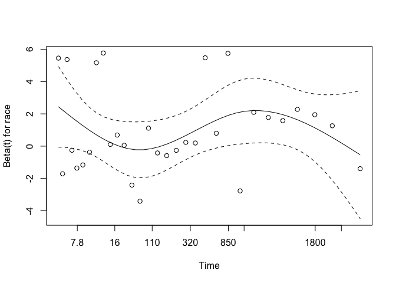

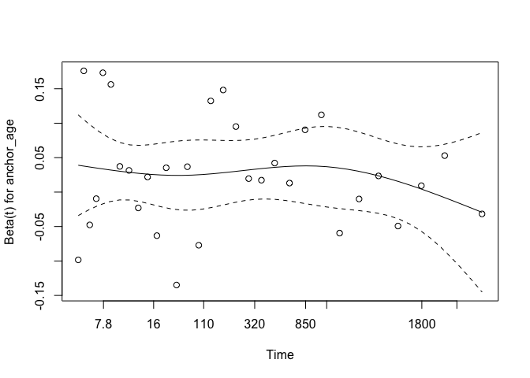

## Admissions

A similar analysis can be conducted at the admissions level.

``` r
admissions_modified <- mutate(admissions, death = ifelse(is.na(deathtime), 0, 1))
admissions_modified <- mutate(admissions_modified, survival_days = as.numeric(dischtime - admittime) / 24)
```

\### Kaplan–Meier curves

``` r
km_fit2 <- survfit(Surv(survival_days, death)~1, data=admissions_modified)
ggsurvplot(km_fit2)
```

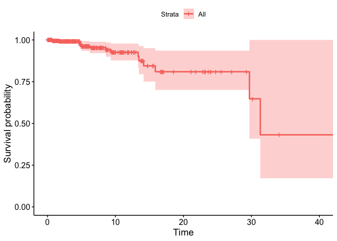

``` r
km_fit3 <- survfit(Surv(survival_days, death)~ race, data=admissions_modified)
ggsurvplot(km_fit3)
```

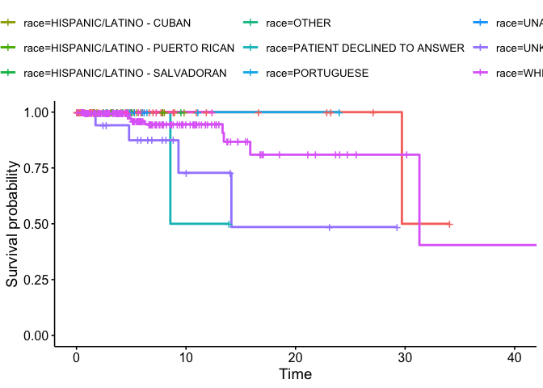

``` r
km_fit4 <- survfit(Surv(survival_days, death)~ insurance, data=admissions_modified)
ggsurvplot(km_fit4)
```

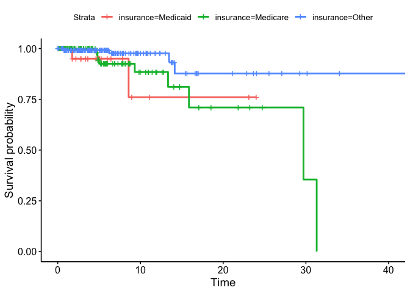

Cox models applied to admissions’ dataset.

``` r
cox_fit2 <- coxph(Surv(survival_days,death)~1, data=admissions_modified)
summary(cox_fit2)
```

    Call:  coxph(formula = Surv(survival_days, death) ~ 1, data = admissions_modified)

    Null model
      log likelihood= -60.20236 
      n= 275 

``` r
cox_fit3 <- coxph(Surv(survival_days, death)~ race, data=admissions_modified)
summary(cox_fit3)
```

    Call:
    coxph(formula = Surv(survival_days, death) ~ race, data = admissions_modified)

      n= 275, number of events= 15 

                                             coef  exp(coef)   se(coef)      z
    raceBLACK/CAPE VERDEAN             -1.732e+01  3.006e-08  3.126e+04 -0.001
    raceHISPANIC OR LATINO             -1.727e+01  3.163e-08  1.006e+05  0.000
    raceHISPANIC/LATINO - CUBAN        -1.730e+01  3.068e-08  2.177e+04 -0.001
    raceHISPANIC/LATINO - PUERTO RICAN -1.732e+01  3.020e-08  4.597e+04  0.000
    raceHISPANIC/LATINO - SALVADORAN   -1.731e+01  3.023e-08  2.913e+04 -0.001
    raceOTHER                          -1.729e+01  3.110e-08  4.050e+04  0.000
    racePATIENT DECLINED TO ANSWER      2.802e+00  1.648e+01  1.458e+00  1.922
    racePORTUGUESE                     -1.715e+01  3.548e-08  1.433e+04 -0.001
    raceUNABLE TO OBTAIN               -1.730e+01  3.063e-08  3.213e+04 -0.001
    raceUNKNOWN                         2.295e+00  9.924e+00  1.156e+00  1.985
    raceWHITE                           9.828e-01  2.672e+00  1.065e+00  0.923
    raceWHITE - BRAZILIAN              -1.731e+01  3.030e-08  2.850e+04 -0.001
    raceWHITE - OTHER EUROPEAN         -1.733e+01  2.989e-08  3.069e+04 -0.001
                                       Pr(>|z|)  
    raceBLACK/CAPE VERDEAN               0.9996  
    raceHISPANIC OR LATINO               0.9999  
    raceHISPANIC/LATINO - CUBAN          0.9994  
    raceHISPANIC/LATINO - PUERTO RICAN   0.9997  
    raceHISPANIC/LATINO - SALVADORAN     0.9995  
    raceOTHER                            0.9997  
    racePATIENT DECLINED TO ANSWER       0.0547 .
    racePORTUGUESE                       0.9990  
    raceUNABLE TO OBTAIN                 0.9996  
    raceUNKNOWN                          0.0472 *
    raceWHITE                            0.3561  
    raceWHITE - BRAZILIAN                0.9995  
    raceWHITE - OTHER EUROPEAN           0.9995  
    ---
    Signif. codes:  0 '***' 0.001 '**' 0.01 '*' 0.05 '.' 0.1 ' ' 1

                                       exp(coef) exp(-coef) lower .95 upper .95
    raceBLACK/CAPE VERDEAN             3.006e-08  3.327e+07    0.0000       Inf
    raceHISPANIC OR LATINO             3.163e-08  3.162e+07    0.0000       Inf
    raceHISPANIC/LATINO - CUBAN        3.068e-08  3.259e+07    0.0000       Inf
    raceHISPANIC/LATINO - PUERTO RICAN 3.020e-08  3.311e+07    0.0000       Inf
    raceHISPANIC/LATINO - SALVADORAN   3.023e-08  3.309e+07    0.0000       Inf
    raceOTHER                          3.110e-08  3.216e+07    0.0000       Inf
    racePATIENT DECLINED TO ANSWER     1.648e+01  6.069e-02    0.9455    287.17
    racePORTUGUESE                     3.548e-08  2.819e+07    0.0000       Inf
    raceUNABLE TO OBTAIN               3.063e-08  3.265e+07    0.0000       Inf
    raceUNKNOWN                        9.924e+00  1.008e-01    1.0291     95.70
    raceWHITE                          2.672e+00  3.743e-01    0.3313     21.55
    raceWHITE - BRAZILIAN              3.030e-08  3.300e+07    0.0000       Inf
    raceWHITE - OTHER EUROPEAN         2.989e-08  3.346e+07    0.0000       Inf

    Concordance= 0.721  (se = 0.059 )
    Likelihood ratio test= 9.81  on 13 df,   p=0.7
    Wald test            = 7.79  on 13 df,   p=0.9
    Score (logrank) test = 12.19  on 13 df,   p=0.5

``` r
cox_fit4 <- coxph(Surv(survival_days, death)~ insurance, data=admissions_modified)
summary(cox_fit4)
```

    Call:
    coxph(formula = Surv(survival_days, death) ~ insurance, data = admissions_modified)

      n= 275, number of events= 15 

                         coef exp(coef) se(coef)      z Pr(>|z|)  
    insuranceMedicare -0.2368    0.7891   0.7917 -0.299   0.7648  
    insuranceOther    -1.5486    0.2126   0.8768 -1.766   0.0774 .
    ---
    Signif. codes:  0 '***' 0.001 '**' 0.01 '*' 0.05 '.' 0.1 ' ' 1

                      exp(coef) exp(-coef) lower .95 upper .95
    insuranceMedicare    0.7891      1.267   0.16721     3.724
    insuranceOther       0.2126      4.705   0.03812     1.185

    Concordance= 0.65  (se = 0.093 )
    Likelihood ratio test= 6.24  on 2 df,   p=0.04
    Wald test            = 5.43  on 2 df,   p=0.07
    Score (logrank) test = 6.31  on 2 df,   p=0.04

## Machine learning

Apply supervised learning algorithms to predict patients_death. Data
preparation: convert response variable to factor, define positive class
first. Use 5-fold cross-validation for model training.

``` r
library(caret)
```

\### Data Preparation

The response variable patients_death is converted into a factor required
by the caret package. The positive class (“YES”) is defined first,
ensuring correct ROC/AUC computation. Labels are renamed to avoid
numeric class names.

``` r
patients_ml <- mutate(patients_mod1, patients_death = factor(patients_death, levels = c(1,0), labels = c("YES", "NO")))
```

### Cross-Validation Setup

``` r
control <- trainControl(method = "cv", number = 5, classProbs = TRUE, summaryFunction = twoClassSummary, 
savePredictions = "final")
```

### Logistic Regression

Random Forest: tune mtry parameter, evaluate variable importance

XGBoost: gradient boosting classifier, evaluate variable importance

Arrange XGBoost results by ROC to find best hyperparameters

``` r
set.seed(5)

reg_log <- train(patients_death ~ race + anchor_age + gender + insurance, data = patients_ml, 
method= "glm", family = binomial, trControl = control, metric = "ROC") 
reg_log 
```

    Generalized Linear Model 

    100 samples
      4 predictor
      2 classes: 'YES', 'NO' 

    No pre-processing
    Resampling: Cross-Validated (5 fold) 
    Summary of sample sizes: 80, 80, 80, 80, 80 
    Resampling results:

      ROC        Sens       Spec    
      0.5199634  0.2666667  0.810989

``` r
summary(reg_log)
```


    Call:
    NULL

    Coefficients:
                        Estimate Std. Error z value Pr(>|z|)  
    (Intercept)          1.63789    1.28810   1.272   0.2035  
    raceLATINO          17.48538 1711.86874   0.010   0.9919  
    raceOTHER            0.56772    0.91157   0.623   0.5334  
    raceWHITE            0.26668    0.80780   0.330   0.7413  
    anchor_age          -0.03033    0.01680  -1.805   0.0711 .
    genderM             -0.38942    0.50441  -0.772   0.4401  
    insuranceMedicare    0.84099    0.86786   0.969   0.3325  
    insuranceOther       1.20154    0.85518   1.405   0.1600  
    ---
    Signif. codes:  0 '***' 0.001 '**' 0.01 '*' 0.05 '.' 0.1 ' ' 1

    (Dispersion parameter for binomial family taken to be 1)

        Null deviance: 123.82  on 99  degrees of freedom
    Residual deviance: 111.70  on 92  degrees of freedom
    AIC: 127.7

    Number of Fisher Scoring iterations: 16

### Random Forest

``` r
set.seed(5)
rf <- train(patients_death ~ race + anchor_age + gender + insurance, data = patients_ml, 
method= "rf", trControl = control, metric = "ROC", tuneGrid = expand.grid(mtry= 2:7)) 
rf
```

    Random Forest 

    100 samples
      4 predictor
      2 classes: 'YES', 'NO' 

    No pre-processing
    Resampling: Cross-Validated (5 fold) 
    Summary of sample sizes: 80, 80, 80, 80, 80 
    Resampling results across tuning parameters:

      mtry  ROC        Sens        Spec     
      2     0.4889194  0.03333333  0.8692308
      3     0.4837912  0.06666667  0.7978022
      4     0.4795788  0.12857143  0.7120879
      5     0.4714286  0.25714286  0.6395604
      6     0.4817766  0.25714286  0.6395604
      7     0.4871795  0.22380952  0.6538462

    ROC was used to select the optimal model using the largest value.
    The final value used for the model was mtry = 2.

### Variable Importance

``` r
importance_rf <- varImp(rf)
plot(importance_rf)
```

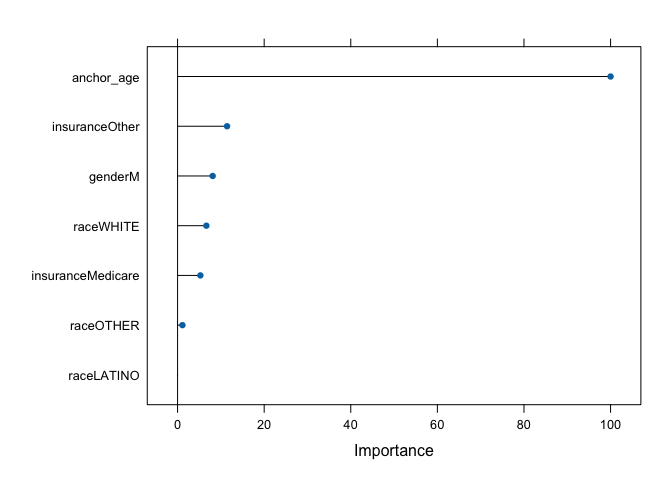

### Extreme Gradient Boosting (XGBoost)

``` r
set.seed(5)
xgb <- train(patients_death ~ race + anchor_age + gender + insurance, data = patients_ml, 
method= "xgbTree", trControl = control, metric = "ROC") 
```

    [22:10:23] WARNING: src/c_api/c_api.cc:935: `ntree_limit` is deprecated, use `iteration_range` instead.
    [22:10:23] WARNING: src/c_api/c_api.cc:935: `ntree_limit` is deprecated, use `iteration_range` instead.
    [22:10:23] WARNING: src/c_api/c_api.cc:935: `ntree_limit` is deprecated, use `iteration_range` instead.
    [22:10:23] WARNING: src/c_api/c_api.cc:935: `ntree_limit` is deprecated, use `iteration_range` instead.
    [22:10:23] WARNING: src/c_api/c_api.cc:935: `ntree_limit` is deprecated, use `iteration_range` instead.
    [22:10:23] WARNING: src/c_api/c_api.cc:935: `ntree_limit` is deprecated, use `iteration_range` instead.
    [22:10:23] WARNING: src/c_api/c_api.cc:935: `ntree_limit` is deprecated, use `iteration_range` instead.
    [22:10:23] WARNING: src/c_api/c_api.cc:935: `ntree_limit` is deprecated, use `iteration_range` instead.
    [22:10:23] WARNING: src/c_api/c_api.cc:935: `ntree_limit` is deprecated, use `iteration_range` instead.
    [22:10:23] WARNING: src/c_api/c_api.cc:935: `ntree_limit` is deprecated, use `iteration_range` instead.
    [22:10:23] WARNING: src/c_api/c_api.cc:935: `ntree_limit` is deprecated, use `iteration_range` instead.
    [22:10:23] WARNING: src/c_api/c_api.cc:935: `ntree_limit` is deprecated, use `iteration_range` instead.
    [22:10:23] WARNING: src/c_api/c_api.cc:935: `ntree_limit` is deprecated, use `iteration_range` instead.
    [22:10:23] WARNING: src/c_api/c_api.cc:935: `ntree_limit` is deprecated, use `iteration_range` instead.
    [22:10:23] WARNING: src/c_api/c_api.cc:935: `ntree_limit` is deprecated, use `iteration_range` instead.
    [22:10:23] WARNING: src/c_api/c_api.cc:935: `ntree_limit` is deprecated, use `iteration_range` instead.
    [22:10:23] WARNING: src/c_api/c_api.cc:935: `ntree_limit` is deprecated, use `iteration_range` instead.
    [22:10:23] WARNING: src/c_api/c_api.cc:935: `ntree_limit` is deprecated, use `iteration_range` instead.
    [22:10:23] WARNING: src/c_api/c_api.cc:935: `ntree_limit` is deprecated, use `iteration_range` instead.
    [22:10:23] WARNING: src/c_api/c_api.cc:935: `ntree_limit` is deprecated, use `iteration_range` instead.
    [22:10:23] WARNING: src/c_api/c_api.cc:935: `ntree_limit` is deprecated, use `iteration_range` instead.
    [22:10:23] WARNING: src/c_api/c_api.cc:935: `ntree_limit` is deprecated, use `iteration_range` instead.
    [22:10:23] WARNING: src/c_api/c_api.cc:935: `ntree_limit` is deprecated, use `iteration_range` instead.
    [22:10:23] WARNING: src/c_api/c_api.cc:935: `ntree_limit` is deprecated, use `iteration_range` instead.
    [22:10:23] WARNING: src/c_api/c_api.cc:935: `ntree_limit` is deprecated, use `iteration_range` instead.
    [22:10:23] WARNING: src/c_api/c_api.cc:935: `ntree_limit` is deprecated, use `iteration_range` instead.
    [22:10:23] WARNING: src/c_api/c_api.cc:935: `ntree_limit` is deprecated, use `iteration_range` instead.
    [22:10:23] WARNING: src/c_api/c_api.cc:935: `ntree_limit` is deprecated, use `iteration_range` instead.
    [22:10:23] WARNING: src/c_api/c_api.cc:935: `ntree_limit` is deprecated, use `iteration_range` instead.
    [22:10:23] WARNING: src/c_api/c_api.cc:935: `ntree_limit` is deprecated, use `iteration_range` instead.
    [22:10:23] WARNING: src/c_api/c_api.cc:935: `ntree_limit` is deprecated, use `iteration_range` instead.
    [22:10:23] WARNING: src/c_api/c_api.cc:935: `ntree_limit` is deprecated, use `iteration_range` instead.
    [22:10:23] WARNING: src/c_api/c_api.cc:935: `ntree_limit` is deprecated, use `iteration_range` instead.
    [22:10:23] WARNING: src/c_api/c_api.cc:935: `ntree_limit` is deprecated, use `iteration_range` instead.
    [22:10:23] WARNING: src/c_api/c_api.cc:935: `ntree_limit` is deprecated, use `iteration_range` instead.
    [22:10:23] WARNING: src/c_api/c_api.cc:935: `ntree_limit` is deprecated, use `iteration_range` instead.
    [22:10:23] WARNING: src/c_api/c_api.cc:935: `ntree_limit` is deprecated, use `iteration_range` instead.
    [22:10:23] WARNING: src/c_api/c_api.cc:935: `ntree_limit` is deprecated, use `iteration_range` instead.
    [22:10:23] WARNING: src/c_api/c_api.cc:935: `ntree_limit` is deprecated, use `iteration_range` instead.
    [22:10:23] WARNING: src/c_api/c_api.cc:935: `ntree_limit` is deprecated, use `iteration_range` instead.
    [22:10:23] WARNING: src/c_api/c_api.cc:935: `ntree_limit` is deprecated, use `iteration_range` instead.
    [22:10:23] WARNING: src/c_api/c_api.cc:935: `ntree_limit` is deprecated, use `iteration_range` instead.
    [22:10:23] WARNING: src/c_api/c_api.cc:935: `ntree_limit` is deprecated, use `iteration_range` instead.
    [22:10:23] WARNING: src/c_api/c_api.cc:935: `ntree_limit` is deprecated, use `iteration_range` instead.
    [22:10:23] WARNING: src/c_api/c_api.cc:935: `ntree_limit` is deprecated, use `iteration_range` instead.
    [22:10:23] WARNING: src/c_api/c_api.cc:935: `ntree_limit` is deprecated, use `iteration_range` instead.
    [22:10:23] WARNING: src/c_api/c_api.cc:935: `ntree_limit` is deprecated, use `iteration_range` instead.
    [22:10:23] WARNING: src/c_api/c_api.cc:935: `ntree_limit` is deprecated, use `iteration_range` instead.
    [22:10:23] WARNING: src/c_api/c_api.cc:935: `ntree_limit` is deprecated, use `iteration_range` instead.
    [22:10:23] WARNING: src/c_api/c_api.cc:935: `ntree_limit` is deprecated, use `iteration_range` instead.
    [22:10:24] WARNING: src/c_api/c_api.cc:935: `ntree_limit` is deprecated, use `iteration_range` instead.
    [22:10:24] WARNING: src/c_api/c_api.cc:935: `ntree_limit` is deprecated, use `iteration_range` instead.
    [22:10:24] WARNING: src/c_api/c_api.cc:935: `ntree_limit` is deprecated, use `iteration_range` instead.
    [22:10:24] WARNING: src/c_api/c_api.cc:935: `ntree_limit` is deprecated, use `iteration_range` instead.
    [22:10:24] WARNING: src/c_api/c_api.cc:935: `ntree_limit` is deprecated, use `iteration_range` instead.
    [22:10:24] WARNING: src/c_api/c_api.cc:935: `ntree_limit` is deprecated, use `iteration_range` instead.
    [22:10:24] WARNING: src/c_api/c_api.cc:935: `ntree_limit` is deprecated, use `iteration_range` instead.
    [22:10:24] WARNING: src/c_api/c_api.cc:935: `ntree_limit` is deprecated, use `iteration_range` instead.
    [22:10:24] WARNING: src/c_api/c_api.cc:935: `ntree_limit` is deprecated, use `iteration_range` instead.
    [22:10:24] WARNING: src/c_api/c_api.cc:935: `ntree_limit` is deprecated, use `iteration_range` instead.
    [22:10:24] WARNING: src/c_api/c_api.cc:935: `ntree_limit` is deprecated, use `iteration_range` instead.
    [22:10:24] WARNING: src/c_api/c_api.cc:935: `ntree_limit` is deprecated, use `iteration_range` instead.
    [22:10:24] WARNING: src/c_api/c_api.cc:935: `ntree_limit` is deprecated, use `iteration_range` instead.
    [22:10:24] WARNING: src/c_api/c_api.cc:935: `ntree_limit` is deprecated, use `iteration_range` instead.
    [22:10:24] WARNING: src/c_api/c_api.cc:935: `ntree_limit` is deprecated, use `iteration_range` instead.
    [22:10:24] WARNING: src/c_api/c_api.cc:935: `ntree_limit` is deprecated, use `iteration_range` instead.
    [22:10:24] WARNING: src/c_api/c_api.cc:935: `ntree_limit` is deprecated, use `iteration_range` instead.
    [22:10:24] WARNING: src/c_api/c_api.cc:935: `ntree_limit` is deprecated, use `iteration_range` instead.
    [22:10:24] WARNING: src/c_api/c_api.cc:935: `ntree_limit` is deprecated, use `iteration_range` instead.
    [22:10:24] WARNING: src/c_api/c_api.cc:935: `ntree_limit` is deprecated, use `iteration_range` instead.
    [22:10:24] WARNING: src/c_api/c_api.cc:935: `ntree_limit` is deprecated, use `iteration_range` instead.
    [22:10:24] WARNING: src/c_api/c_api.cc:935: `ntree_limit` is deprecated, use `iteration_range` instead.
    [22:10:24] WARNING: src/c_api/c_api.cc:935: `ntree_limit` is deprecated, use `iteration_range` instead.
    [22:10:24] WARNING: src/c_api/c_api.cc:935: `ntree_limit` is deprecated, use `iteration_range` instead.
    [22:10:24] WARNING: src/c_api/c_api.cc:935: `ntree_limit` is deprecated, use `iteration_range` instead.
    [22:10:24] WARNING: src/c_api/c_api.cc:935: `ntree_limit` is deprecated, use `iteration_range` instead.
    [22:10:24] WARNING: src/c_api/c_api.cc:935: `ntree_limit` is deprecated, use `iteration_range` instead.
    [22:10:24] WARNING: src/c_api/c_api.cc:935: `ntree_limit` is deprecated, use `iteration_range` instead.
    [22:10:24] WARNING: src/c_api/c_api.cc:935: `ntree_limit` is deprecated, use `iteration_range` instead.
    [22:10:24] WARNING: src/c_api/c_api.cc:935: `ntree_limit` is deprecated, use `iteration_range` instead.
    [22:10:24] WARNING: src/c_api/c_api.cc:935: `ntree_limit` is deprecated, use `iteration_range` instead.
    [22:10:24] WARNING: src/c_api/c_api.cc:935: `ntree_limit` is deprecated, use `iteration_range` instead.
    [22:10:24] WARNING: src/c_api/c_api.cc:935: `ntree_limit` is deprecated, use `iteration_range` instead.
    [22:10:24] WARNING: src/c_api/c_api.cc:935: `ntree_limit` is deprecated, use `iteration_range` instead.
    [22:10:24] WARNING: src/c_api/c_api.cc:935: `ntree_limit` is deprecated, use `iteration_range` instead.
    [22:10:24] WARNING: src/c_api/c_api.cc:935: `ntree_limit` is deprecated, use `iteration_range` instead.
    [22:10:24] WARNING: src/c_api/c_api.cc:935: `ntree_limit` is deprecated, use `iteration_range` instead.
    [22:10:24] WARNING: src/c_api/c_api.cc:935: `ntree_limit` is deprecated, use `iteration_range` instead.
    [22:10:24] WARNING: src/c_api/c_api.cc:935: `ntree_limit` is deprecated, use `iteration_range` instead.
    [22:10:24] WARNING: src/c_api/c_api.cc:935: `ntree_limit` is deprecated, use `iteration_range` instead.
    [22:10:24] WARNING: src/c_api/c_api.cc:935: `ntree_limit` is deprecated, use `iteration_range` instead.
    [22:10:24] WARNING: src/c_api/c_api.cc:935: `ntree_limit` is deprecated, use `iteration_range` instead.
    [22:10:24] WARNING: src/c_api/c_api.cc:935: `ntree_limit` is deprecated, use `iteration_range` instead.
    [22:10:24] WARNING: src/c_api/c_api.cc:935: `ntree_limit` is deprecated, use `iteration_range` instead.
    [22:10:24] WARNING: src/c_api/c_api.cc:935: `ntree_limit` is deprecated, use `iteration_range` instead.
    [22:10:24] WARNING: src/c_api/c_api.cc:935: `ntree_limit` is deprecated, use `iteration_range` instead.
    [22:10:24] WARNING: src/c_api/c_api.cc:935: `ntree_limit` is deprecated, use `iteration_range` instead.
    [22:10:24] WARNING: src/c_api/c_api.cc:935: `ntree_limit` is deprecated, use `iteration_range` instead.
    [22:10:24] WARNING: src/c_api/c_api.cc:935: `ntree_limit` is deprecated, use `iteration_range` instead.
    [22:10:24] WARNING: src/c_api/c_api.cc:935: `ntree_limit` is deprecated, use `iteration_range` instead.
    [22:10:24] WARNING: src/c_api/c_api.cc:935: `ntree_limit` is deprecated, use `iteration_range` instead.
    [22:10:24] WARNING: src/c_api/c_api.cc:935: `ntree_limit` is deprecated, use `iteration_range` instead.
    [22:10:24] WARNING: src/c_api/c_api.cc:935: `ntree_limit` is deprecated, use `iteration_range` instead.
    [22:10:24] WARNING: src/c_api/c_api.cc:935: `ntree_limit` is deprecated, use `iteration_range` instead.
    [22:10:24] WARNING: src/c_api/c_api.cc:935: `ntree_limit` is deprecated, use `iteration_range` instead.
    [22:10:24] WARNING: src/c_api/c_api.cc:935: `ntree_limit` is deprecated, use `iteration_range` instead.
    [22:10:24] WARNING: src/c_api/c_api.cc:935: `ntree_limit` is deprecated, use `iteration_range` instead.
    [22:10:24] WARNING: src/c_api/c_api.cc:935: `ntree_limit` is deprecated, use `iteration_range` instead.
    [22:10:24] WARNING: src/c_api/c_api.cc:935: `ntree_limit` is deprecated, use `iteration_range` instead.
    [22:10:24] WARNING: src/c_api/c_api.cc:935: `ntree_limit` is deprecated, use `iteration_range` instead.
    [22:10:24] WARNING: src/c_api/c_api.cc:935: `ntree_limit` is deprecated, use `iteration_range` instead.
    [22:10:24] WARNING: src/c_api/c_api.cc:935: `ntree_limit` is deprecated, use `iteration_range` instead.
    [22:10:24] WARNING: src/c_api/c_api.cc:935: `ntree_limit` is deprecated, use `iteration_range` instead.
    [22:10:24] WARNING: src/c_api/c_api.cc:935: `ntree_limit` is deprecated, use `iteration_range` instead.
    [22:10:24] WARNING: src/c_api/c_api.cc:935: `ntree_limit` is deprecated, use `iteration_range` instead.
    [22:10:24] WARNING: src/c_api/c_api.cc:935: `ntree_limit` is deprecated, use `iteration_range` instead.
    [22:10:24] WARNING: src/c_api/c_api.cc:935: `ntree_limit` is deprecated, use `iteration_range` instead.
    [22:10:24] WARNING: src/c_api/c_api.cc:935: `ntree_limit` is deprecated, use `iteration_range` instead.
    [22:10:24] WARNING: src/c_api/c_api.cc:935: `ntree_limit` is deprecated, use `iteration_range` instead.
    [22:10:24] WARNING: src/c_api/c_api.cc:935: `ntree_limit` is deprecated, use `iteration_range` instead.
    [22:10:24] WARNING: src/c_api/c_api.cc:935: `ntree_limit` is deprecated, use `iteration_range` instead.
    [22:10:24] WARNING: src/c_api/c_api.cc:935: `ntree_limit` is deprecated, use `iteration_range` instead.
    [22:10:24] WARNING: src/c_api/c_api.cc:935: `ntree_limit` is deprecated, use `iteration_range` instead.
    [22:10:24] WARNING: src/c_api/c_api.cc:935: `ntree_limit` is deprecated, use `iteration_range` instead.
    [22:10:24] WARNING: src/c_api/c_api.cc:935: `ntree_limit` is deprecated, use `iteration_range` instead.
    [22:10:24] WARNING: src/c_api/c_api.cc:935: `ntree_limit` is deprecated, use `iteration_range` instead.
    [22:10:24] WARNING: src/c_api/c_api.cc:935: `ntree_limit` is deprecated, use `iteration_range` instead.
    [22:10:24] WARNING: src/c_api/c_api.cc:935: `ntree_limit` is deprecated, use `iteration_range` instead.
    [22:10:24] WARNING: src/c_api/c_api.cc:935: `ntree_limit` is deprecated, use `iteration_range` instead.
    [22:10:24] WARNING: src/c_api/c_api.cc:935: `ntree_limit` is deprecated, use `iteration_range` instead.
    [22:10:24] WARNING: src/c_api/c_api.cc:935: `ntree_limit` is deprecated, use `iteration_range` instead.
    [22:10:24] WARNING: src/c_api/c_api.cc:935: `ntree_limit` is deprecated, use `iteration_range` instead.
    [22:10:24] WARNING: src/c_api/c_api.cc:935: `ntree_limit` is deprecated, use `iteration_range` instead.
    [22:10:24] WARNING: src/c_api/c_api.cc:935: `ntree_limit` is deprecated, use `iteration_range` instead.
    [22:10:24] WARNING: src/c_api/c_api.cc:935: `ntree_limit` is deprecated, use `iteration_range` instead.
    [22:10:24] WARNING: src/c_api/c_api.cc:935: `ntree_limit` is deprecated, use `iteration_range` instead.
    [22:10:24] WARNING: src/c_api/c_api.cc:935: `ntree_limit` is deprecated, use `iteration_range` instead.
    [22:10:24] WARNING: src/c_api/c_api.cc:935: `ntree_limit` is deprecated, use `iteration_range` instead.
    [22:10:24] WARNING: src/c_api/c_api.cc:935: `ntree_limit` is deprecated, use `iteration_range` instead.
    [22:10:24] WARNING: src/c_api/c_api.cc:935: `ntree_limit` is deprecated, use `iteration_range` instead.
    [22:10:24] WARNING: src/c_api/c_api.cc:935: `ntree_limit` is deprecated, use `iteration_range` instead.
    [22:10:24] WARNING: src/c_api/c_api.cc:935: `ntree_limit` is deprecated, use `iteration_range` instead.
    [22:10:24] WARNING: src/c_api/c_api.cc:935: `ntree_limit` is deprecated, use `iteration_range` instead.
    [22:10:24] WARNING: src/c_api/c_api.cc:935: `ntree_limit` is deprecated, use `iteration_range` instead.
    [22:10:24] WARNING: src/c_api/c_api.cc:935: `ntree_limit` is deprecated, use `iteration_range` instead.
    [22:10:24] WARNING: src/c_api/c_api.cc:935: `ntree_limit` is deprecated, use `iteration_range` instead.
    [22:10:24] WARNING: src/c_api/c_api.cc:935: `ntree_limit` is deprecated, use `iteration_range` instead.
    [22:10:24] WARNING: src/c_api/c_api.cc:935: `ntree_limit` is deprecated, use `iteration_range` instead.
    [22:10:24] WARNING: src/c_api/c_api.cc:935: `ntree_limit` is deprecated, use `iteration_range` instead.
    [22:10:24] WARNING: src/c_api/c_api.cc:935: `ntree_limit` is deprecated, use `iteration_range` instead.
    [22:10:24] WARNING: src/c_api/c_api.cc:935: `ntree_limit` is deprecated, use `iteration_range` instead.
    [22:10:24] WARNING: src/c_api/c_api.cc:935: `ntree_limit` is deprecated, use `iteration_range` instead.
    [22:10:24] WARNING: src/c_api/c_api.cc:935: `ntree_limit` is deprecated, use `iteration_range` instead.
    [22:10:24] WARNING: src/c_api/c_api.cc:935: `ntree_limit` is deprecated, use `iteration_range` instead.
    [22:10:24] WARNING: src/c_api/c_api.cc:935: `ntree_limit` is deprecated, use `iteration_range` instead.
    [22:10:24] WARNING: src/c_api/c_api.cc:935: `ntree_limit` is deprecated, use `iteration_range` instead.
    [22:10:24] WARNING: src/c_api/c_api.cc:935: `ntree_limit` is deprecated, use `iteration_range` instead.
    [22:10:24] WARNING: src/c_api/c_api.cc:935: `ntree_limit` is deprecated, use `iteration_range` instead.
    [22:10:24] WARNING: src/c_api/c_api.cc:935: `ntree_limit` is deprecated, use `iteration_range` instead.
    [22:10:24] WARNING: src/c_api/c_api.cc:935: `ntree_limit` is deprecated, use `iteration_range` instead.
    [22:10:24] WARNING: src/c_api/c_api.cc:935: `ntree_limit` is deprecated, use `iteration_range` instead.
    [22:10:24] WARNING: src/c_api/c_api.cc:935: `ntree_limit` is deprecated, use `iteration_range` instead.
    [22:10:24] WARNING: src/c_api/c_api.cc:935: `ntree_limit` is deprecated, use `iteration_range` instead.
    [22:10:24] WARNING: src/c_api/c_api.cc:935: `ntree_limit` is deprecated, use `iteration_range` instead.
    [22:10:24] WARNING: src/c_api/c_api.cc:935: `ntree_limit` is deprecated, use `iteration_range` instead.
    [22:10:24] WARNING: src/c_api/c_api.cc:935: `ntree_limit` is deprecated, use `iteration_range` instead.
    [22:10:24] WARNING: src/c_api/c_api.cc:935: `ntree_limit` is deprecated, use `iteration_range` instead.
    [22:10:24] WARNING: src/c_api/c_api.cc:935: `ntree_limit` is deprecated, use `iteration_range` instead.
    [22:10:24] WARNING: src/c_api/c_api.cc:935: `ntree_limit` is deprecated, use `iteration_range` instead.
    [22:10:24] WARNING: src/c_api/c_api.cc:935: `ntree_limit` is deprecated, use `iteration_range` instead.
    [22:10:24] WARNING: src/c_api/c_api.cc:935: `ntree_limit` is deprecated, use `iteration_range` instead.
    [22:10:24] WARNING: src/c_api/c_api.cc:935: `ntree_limit` is deprecated, use `iteration_range` instead.
    [22:10:24] WARNING: src/c_api/c_api.cc:935: `ntree_limit` is deprecated, use `iteration_range` instead.
    [22:10:24] WARNING: src/c_api/c_api.cc:935: `ntree_limit` is deprecated, use `iteration_range` instead.
    [22:10:24] WARNING: src/c_api/c_api.cc:935: `ntree_limit` is deprecated, use `iteration_range` instead.
    [22:10:24] WARNING: src/c_api/c_api.cc:935: `ntree_limit` is deprecated, use `iteration_range` instead.
    [22:10:24] WARNING: src/c_api/c_api.cc:935: `ntree_limit` is deprecated, use `iteration_range` instead.
    [22:10:24] WARNING: src/c_api/c_api.cc:935: `ntree_limit` is deprecated, use `iteration_range` instead.
    [22:10:24] WARNING: src/c_api/c_api.cc:935: `ntree_limit` is deprecated, use `iteration_range` instead.
    [22:10:24] WARNING: src/c_api/c_api.cc:935: `ntree_limit` is deprecated, use `iteration_range` instead.
    [22:10:24] WARNING: src/c_api/c_api.cc:935: `ntree_limit` is deprecated, use `iteration_range` instead.
    [22:10:24] WARNING: src/c_api/c_api.cc:935: `ntree_limit` is deprecated, use `iteration_range` instead.
    [22:10:24] WARNING: src/c_api/c_api.cc:935: `ntree_limit` is deprecated, use `iteration_range` instead.
    [22:10:24] WARNING: src/c_api/c_api.cc:935: `ntree_limit` is deprecated, use `iteration_range` instead.
    [22:10:24] WARNING: src/c_api/c_api.cc:935: `ntree_limit` is deprecated, use `iteration_range` instead.
    [22:10:24] WARNING: src/c_api/c_api.cc:935: `ntree_limit` is deprecated, use `iteration_range` instead.
    [22:10:24] WARNING: src/c_api/c_api.cc:935: `ntree_limit` is deprecated, use `iteration_range` instead.
    [22:10:24] WARNING: src/c_api/c_api.cc:935: `ntree_limit` is deprecated, use `iteration_range` instead.
    [22:10:24] WARNING: src/c_api/c_api.cc:935: `ntree_limit` is deprecated, use `iteration_range` instead.
    [22:10:24] WARNING: src/c_api/c_api.cc:935: `ntree_limit` is deprecated, use `iteration_range` instead.
    [22:10:24] WARNING: src/c_api/c_api.cc:935: `ntree_limit` is deprecated, use `iteration_range` instead.
    [22:10:24] WARNING: src/c_api/c_api.cc:935: `ntree_limit` is deprecated, use `iteration_range` instead.
    [22:10:24] WARNING: src/c_api/c_api.cc:935: `ntree_limit` is deprecated, use `iteration_range` instead.
    [22:10:24] WARNING: src/c_api/c_api.cc:935: `ntree_limit` is deprecated, use `iteration_range` instead.
    [22:10:24] WARNING: src/c_api/c_api.cc:935: `ntree_limit` is deprecated, use `iteration_range` instead.
    [22:10:24] WARNING: src/c_api/c_api.cc:935: `ntree_limit` is deprecated, use `iteration_range` instead.
    [22:10:24] WARNING: src/c_api/c_api.cc:935: `ntree_limit` is deprecated, use `iteration_range` instead.
    [22:10:24] WARNING: src/c_api/c_api.cc:935: `ntree_limit` is deprecated, use `iteration_range` instead.
    [22:10:24] WARNING: src/c_api/c_api.cc:935: `ntree_limit` is deprecated, use `iteration_range` instead.
    [22:10:24] WARNING: src/c_api/c_api.cc:935: `ntree_limit` is deprecated, use `iteration_range` instead.
    [22:10:24] WARNING: src/c_api/c_api.cc:935: `ntree_limit` is deprecated, use `iteration_range` instead.
    [22:10:24] WARNING: src/c_api/c_api.cc:935: `ntree_limit` is deprecated, use `iteration_range` instead.
    [22:10:24] WARNING: src/c_api/c_api.cc:935: `ntree_limit` is deprecated, use `iteration_range` instead.
    [22:10:24] WARNING: src/c_api/c_api.cc:935: `ntree_limit` is deprecated, use `iteration_range` instead.
    [22:10:24] WARNING: src/c_api/c_api.cc:935: `ntree_limit` is deprecated, use `iteration_range` instead.
    [22:10:24] WARNING: src/c_api/c_api.cc:935: `ntree_limit` is deprecated, use `iteration_range` instead.
    [22:10:24] WARNING: src/c_api/c_api.cc:935: `ntree_limit` is deprecated, use `iteration_range` instead.
    [22:10:24] WARNING: src/c_api/c_api.cc:935: `ntree_limit` is deprecated, use `iteration_range` instead.
    [22:10:24] WARNING: src/c_api/c_api.cc:935: `ntree_limit` is deprecated, use `iteration_range` instead.
    [22:10:24] WARNING: src/c_api/c_api.cc:935: `ntree_limit` is deprecated, use `iteration_range` instead.
    [22:10:24] WARNING: src/c_api/c_api.cc:935: `ntree_limit` is deprecated, use `iteration_range` instead.
    [22:10:24] WARNING: src/c_api/c_api.cc:935: `ntree_limit` is deprecated, use `iteration_range` instead.
    [22:10:24] WARNING: src/c_api/c_api.cc:935: `ntree_limit` is deprecated, use `iteration_range` instead.
    [22:10:24] WARNING: src/c_api/c_api.cc:935: `ntree_limit` is deprecated, use `iteration_range` instead.
    [22:10:24] WARNING: src/c_api/c_api.cc:935: `ntree_limit` is deprecated, use `iteration_range` instead.
    [22:10:24] WARNING: src/c_api/c_api.cc:935: `ntree_limit` is deprecated, use `iteration_range` instead.
    [22:10:24] WARNING: src/c_api/c_api.cc:935: `ntree_limit` is deprecated, use `iteration_range` instead.
    [22:10:24] WARNING: src/c_api/c_api.cc:935: `ntree_limit` is deprecated, use `iteration_range` instead.
    [22:10:24] WARNING: src/c_api/c_api.cc:935: `ntree_limit` is deprecated, use `iteration_range` instead.
    [22:10:24] WARNING: src/c_api/c_api.cc:935: `ntree_limit` is deprecated, use `iteration_range` instead.
    [22:10:24] WARNING: src/c_api/c_api.cc:935: `ntree_limit` is deprecated, use `iteration_range` instead.
    [22:10:24] WARNING: src/c_api/c_api.cc:935: `ntree_limit` is deprecated, use `iteration_range` instead.
    [22:10:24] WARNING: src/c_api/c_api.cc:935: `ntree_limit` is deprecated, use `iteration_range` instead.
    [22:10:24] WARNING: src/c_api/c_api.cc:935: `ntree_limit` is deprecated, use `iteration_range` instead.
    [22:10:24] WARNING: src/c_api/c_api.cc:935: `ntree_limit` is deprecated, use `iteration_range` instead.
    [22:10:24] WARNING: src/c_api/c_api.cc:935: `ntree_limit` is deprecated, use `iteration_range` instead.
    [22:10:24] WARNING: src/c_api/c_api.cc:935: `ntree_limit` is deprecated, use `iteration_range` instead.
    [22:10:24] WARNING: src/c_api/c_api.cc:935: `ntree_limit` is deprecated, use `iteration_range` instead.
    [22:10:24] WARNING: src/c_api/c_api.cc:935: `ntree_limit` is deprecated, use `iteration_range` instead.
    [22:10:24] WARNING: src/c_api/c_api.cc:935: `ntree_limit` is deprecated, use `iteration_range` instead.
    [22:10:24] WARNING: src/c_api/c_api.cc:935: `ntree_limit` is deprecated, use `iteration_range` instead.
    [22:10:24] WARNING: src/c_api/c_api.cc:935: `ntree_limit` is deprecated, use `iteration_range` instead.
    [22:10:24] WARNING: src/c_api/c_api.cc:935: `ntree_limit` is deprecated, use `iteration_range` instead.
    [22:10:24] WARNING: src/c_api/c_api.cc:935: `ntree_limit` is deprecated, use `iteration_range` instead.
    [22:10:24] WARNING: src/c_api/c_api.cc:935: `ntree_limit` is deprecated, use `iteration_range` instead.
    [22:10:24] WARNING: src/c_api/c_api.cc:935: `ntree_limit` is deprecated, use `iteration_range` instead.
    [22:10:24] WARNING: src/c_api/c_api.cc:935: `ntree_limit` is deprecated, use `iteration_range` instead.
    [22:10:24] WARNING: src/c_api/c_api.cc:935: `ntree_limit` is deprecated, use `iteration_range` instead.
    [22:10:24] WARNING: src/c_api/c_api.cc:935: `ntree_limit` is deprecated, use `iteration_range` instead.
    [22:10:24] WARNING: src/c_api/c_api.cc:935: `ntree_limit` is deprecated, use `iteration_range` instead.
    [22:10:24] WARNING: src/c_api/c_api.cc:935: `ntree_limit` is deprecated, use `iteration_range` instead.
    [22:10:24] WARNING: src/c_api/c_api.cc:935: `ntree_limit` is deprecated, use `iteration_range` instead.
    [22:10:24] WARNING: src/c_api/c_api.cc:935: `ntree_limit` is deprecated, use `iteration_range` instead.
    [22:10:24] WARNING: src/c_api/c_api.cc:935: `ntree_limit` is deprecated, use `iteration_range` instead.
    [22:10:24] WARNING: src/c_api/c_api.cc:935: `ntree_limit` is deprecated, use `iteration_range` instead.
    [22:10:24] WARNING: src/c_api/c_api.cc:935: `ntree_limit` is deprecated, use `iteration_range` instead.
    [22:10:24] WARNING: src/c_api/c_api.cc:935: `ntree_limit` is deprecated, use `iteration_range` instead.
    [22:10:24] WARNING: src/c_api/c_api.cc:935: `ntree_limit` is deprecated, use `iteration_range` instead.
    [22:10:24] WARNING: src/c_api/c_api.cc:935: `ntree_limit` is deprecated, use `iteration_range` instead.
    [22:10:24] WARNING: src/c_api/c_api.cc:935: `ntree_limit` is deprecated, use `iteration_range` instead.
    [22:10:24] WARNING: src/c_api/c_api.cc:935: `ntree_limit` is deprecated, use `iteration_range` instead.
    [22:10:24] WARNING: src/c_api/c_api.cc:935: `ntree_limit` is deprecated, use `iteration_range` instead.
    [22:10:24] WARNING: src/c_api/c_api.cc:935: `ntree_limit` is deprecated, use `iteration_range` instead.
    [22:10:24] WARNING: src/c_api/c_api.cc:935: `ntree_limit` is deprecated, use `iteration_range` instead.
    [22:10:24] WARNING: src/c_api/c_api.cc:935: `ntree_limit` is deprecated, use `iteration_range` instead.
    [22:10:24] WARNING: src/c_api/c_api.cc:935: `ntree_limit` is deprecated, use `iteration_range` instead.
    [22:10:24] WARNING: src/c_api/c_api.cc:935: `ntree_limit` is deprecated, use `iteration_range` instead.
    [22:10:24] WARNING: src/c_api/c_api.cc:935: `ntree_limit` is deprecated, use `iteration_range` instead.
    [22:10:24] WARNING: src/c_api/c_api.cc:935: `ntree_limit` is deprecated, use `iteration_range` instead.
    [22:10:24] WARNING: src/c_api/c_api.cc:935: `ntree_limit` is deprecated, use `iteration_range` instead.
    [22:10:24] WARNING: src/c_api/c_api.cc:935: `ntree_limit` is deprecated, use `iteration_range` instead.
    [22:10:24] WARNING: src/c_api/c_api.cc:935: `ntree_limit` is deprecated, use `iteration_range` instead.
    [22:10:24] WARNING: src/c_api/c_api.cc:935: `ntree_limit` is deprecated, use `iteration_range` instead.
    [22:10:24] WARNING: src/c_api/c_api.cc:935: `ntree_limit` is deprecated, use `iteration_range` instead.
    [22:10:24] WARNING: src/c_api/c_api.cc:935: `ntree_limit` is deprecated, use `iteration_range` instead.
    [22:10:24] WARNING: src/c_api/c_api.cc:935: `ntree_limit` is deprecated, use `iteration_range` instead.
    [22:10:24] WARNING: src/c_api/c_api.cc:935: `ntree_limit` is deprecated, use `iteration_range` instead.
    [22:10:24] WARNING: src/c_api/c_api.cc:935: `ntree_limit` is deprecated, use `iteration_range` instead.
    [22:10:24] WARNING: src/c_api/c_api.cc:935: `ntree_limit` is deprecated, use `iteration_range` instead.
    [22:10:24] WARNING: src/c_api/c_api.cc:935: `ntree_limit` is deprecated, use `iteration_range` instead.
    [22:10:24] WARNING: src/c_api/c_api.cc:935: `ntree_limit` is deprecated, use `iteration_range` instead.
    [22:10:24] WARNING: src/c_api/c_api.cc:935: `ntree_limit` is deprecated, use `iteration_range` instead.
    [22:10:24] WARNING: src/c_api/c_api.cc:935: `ntree_limit` is deprecated, use `iteration_range` instead.
    [22:10:24] WARNING: src/c_api/c_api.cc:935: `ntree_limit` is deprecated, use `iteration_range` instead.
    [22:10:24] WARNING: src/c_api/c_api.cc:935: `ntree_limit` is deprecated, use `iteration_range` instead.
    [22:10:24] WARNING: src/c_api/c_api.cc:935: `ntree_limit` is deprecated, use `iteration_range` instead.
    [22:10:24] WARNING: src/c_api/c_api.cc:935: `ntree_limit` is deprecated, use `iteration_range` instead.
    [22:10:24] WARNING: src/c_api/c_api.cc:935: `ntree_limit` is deprecated, use `iteration_range` instead.
    [22:10:24] WARNING: src/c_api/c_api.cc:935: `ntree_limit` is deprecated, use `iteration_range` instead.
    [22:10:24] WARNING: src/c_api/c_api.cc:935: `ntree_limit` is deprecated, use `iteration_range` instead.
    [22:10:24] WARNING: src/c_api/c_api.cc:935: `ntree_limit` is deprecated, use `iteration_range` instead.
    [22:10:24] WARNING: src/c_api/c_api.cc:935: `ntree_limit` is deprecated, use `iteration_range` instead.
    [22:10:24] WARNING: src/c_api/c_api.cc:935: `ntree_limit` is deprecated, use `iteration_range` instead.
    [22:10:24] WARNING: src/c_api/c_api.cc:935: `ntree_limit` is deprecated, use `iteration_range` instead.
    [22:10:24] WARNING: src/c_api/c_api.cc:935: `ntree_limit` is deprecated, use `iteration_range` instead.
    [22:10:24] WARNING: src/c_api/c_api.cc:935: `ntree_limit` is deprecated, use `iteration_range` instead.
    [22:10:24] WARNING: src/c_api/c_api.cc:935: `ntree_limit` is deprecated, use `iteration_range` instead.
    [22:10:24] WARNING: src/c_api/c_api.cc:935: `ntree_limit` is deprecated, use `iteration_range` instead.
    [22:10:24] WARNING: src/c_api/c_api.cc:935: `ntree_limit` is deprecated, use `iteration_range` instead.
    [22:10:24] WARNING: src/c_api/c_api.cc:935: `ntree_limit` is deprecated, use `iteration_range` instead.
    [22:10:24] WARNING: src/c_api/c_api.cc:935: `ntree_limit` is deprecated, use `iteration_range` instead.
    [22:10:24] WARNING: src/c_api/c_api.cc:935: `ntree_limit` is deprecated, use `iteration_range` instead.
    [22:10:24] WARNING: src/c_api/c_api.cc:935: `ntree_limit` is deprecated, use `iteration_range` instead.
    [22:10:24] WARNING: src/c_api/c_api.cc:935: `ntree_limit` is deprecated, use `iteration_range` instead.
    [22:10:24] WARNING: src/c_api/c_api.cc:935: `ntree_limit` is deprecated, use `iteration_range` instead.
    [22:10:24] WARNING: src/c_api/c_api.cc:935: `ntree_limit` is deprecated, use `iteration_range` instead.
    [22:10:24] WARNING: src/c_api/c_api.cc:935: `ntree_limit` is deprecated, use `iteration_range` instead.
    [22:10:24] WARNING: src/c_api/c_api.cc:935: `ntree_limit` is deprecated, use `iteration_range` instead.
    [22:10:24] WARNING: src/c_api/c_api.cc:935: `ntree_limit` is deprecated, use `iteration_range` instead.
    [22:10:24] WARNING: src/c_api/c_api.cc:935: `ntree_limit` is deprecated, use `iteration_range` instead.
    [22:10:24] WARNING: src/c_api/c_api.cc:935: `ntree_limit` is deprecated, use `iteration_range` instead.
    [22:10:24] WARNING: src/c_api/c_api.cc:935: `ntree_limit` is deprecated, use `iteration_range` instead.
    [22:10:24] WARNING: src/c_api/c_api.cc:935: `ntree_limit` is deprecated, use `iteration_range` instead.
    [22:10:24] WARNING: src/c_api/c_api.cc:935: `ntree_limit` is deprecated, use `iteration_range` instead.
    [22:10:24] WARNING: src/c_api/c_api.cc:935: `ntree_limit` is deprecated, use `iteration_range` instead.
    [22:10:24] WARNING: src/c_api/c_api.cc:935: `ntree_limit` is deprecated, use `iteration_range` instead.
    [22:10:24] WARNING: src/c_api/c_api.cc:935: `ntree_limit` is deprecated, use `iteration_range` instead.
    [22:10:24] WARNING: src/c_api/c_api.cc:935: `ntree_limit` is deprecated, use `iteration_range` instead.
    [22:10:24] WARNING: src/c_api/c_api.cc:935: `ntree_limit` is deprecated, use `iteration_range` instead.
    [22:10:24] WARNING: src/c_api/c_api.cc:935: `ntree_limit` is deprecated, use `iteration_range` instead.
    [22:10:24] WARNING: src/c_api/c_api.cc:935: `ntree_limit` is deprecated, use `iteration_range` instead.
    [22:10:24] WARNING: src/c_api/c_api.cc:935: `ntree_limit` is deprecated, use `iteration_range` instead.
    [22:10:24] WARNING: src/c_api/c_api.cc:935: `ntree_limit` is deprecated, use `iteration_range` instead.
    [22:10:24] WARNING: src/c_api/c_api.cc:935: `ntree_limit` is deprecated, use `iteration_range` instead.
    [22:10:24] WARNING: src/c_api/c_api.cc:935: `ntree_limit` is deprecated, use `iteration_range` instead.
    [22:10:24] WARNING: src/c_api/c_api.cc:935: `ntree_limit` is deprecated, use `iteration_range` instead.
    [22:10:24] WARNING: src/c_api/c_api.cc:935: `ntree_limit` is deprecated, use `iteration_range` instead.
    [22:10:24] WARNING: src/c_api/c_api.cc:935: `ntree_limit` is deprecated, use `iteration_range` instead.
    [22:10:24] WARNING: src/c_api/c_api.cc:935: `ntree_limit` is deprecated, use `iteration_range` instead.
    [22:10:24] WARNING: src/c_api/c_api.cc:935: `ntree_limit` is deprecated, use `iteration_range` instead.
    [22:10:24] WARNING: src/c_api/c_api.cc:935: `ntree_limit` is deprecated, use `iteration_range` instead.
    [22:10:24] WARNING: src/c_api/c_api.cc:935: `ntree_limit` is deprecated, use `iteration_range` instead.
    [22:10:24] WARNING: src/c_api/c_api.cc:935: `ntree_limit` is deprecated, use `iteration_range` instead.
    [22:10:24] WARNING: src/c_api/c_api.cc:935: `ntree_limit` is deprecated, use `iteration_range` instead.
    [22:10:24] WARNING: src/c_api/c_api.cc:935: `ntree_limit` is deprecated, use `iteration_range` instead.
    [22:10:24] WARNING: src/c_api/c_api.cc:935: `ntree_limit` is deprecated, use `iteration_range` instead.
    [22:10:24] WARNING: src/c_api/c_api.cc:935: `ntree_limit` is deprecated, use `iteration_range` instead.
    [22:10:24] WARNING: src/c_api/c_api.cc:935: `ntree_limit` is deprecated, use `iteration_range` instead.
    [22:10:24] WARNING: src/c_api/c_api.cc:935: `ntree_limit` is deprecated, use `iteration_range` instead.
    [22:10:24] WARNING: src/c_api/c_api.cc:935: `ntree_limit` is deprecated, use `iteration_range` instead.
    [22:10:24] WARNING: src/c_api/c_api.cc:935: `ntree_limit` is deprecated, use `iteration_range` instead.
    [22:10:24] WARNING: src/c_api/c_api.cc:935: `ntree_limit` is deprecated, use `iteration_range` instead.
    [22:10:24] WARNING: src/c_api/c_api.cc:935: `ntree_limit` is deprecated, use `iteration_range` instead.
    [22:10:24] WARNING: src/c_api/c_api.cc:935: `ntree_limit` is deprecated, use `iteration_range` instead.
    [22:10:24] WARNING: src/c_api/c_api.cc:935: `ntree_limit` is deprecated, use `iteration_range` instead.
    [22:10:24] WARNING: src/c_api/c_api.cc:935: `ntree_limit` is deprecated, use `iteration_range` instead.
    [22:10:24] WARNING: src/c_api/c_api.cc:935: `ntree_limit` is deprecated, use `iteration_range` instead.
    [22:10:24] WARNING: src/c_api/c_api.cc:935: `ntree_limit` is deprecated, use `iteration_range` instead.
    [22:10:24] WARNING: src/c_api/c_api.cc:935: `ntree_limit` is deprecated, use `iteration_range` instead.
    [22:10:24] WARNING: src/c_api/c_api.cc:935: `ntree_limit` is deprecated, use `iteration_range` instead.
    [22:10:24] WARNING: src/c_api/c_api.cc:935: `ntree_limit` is deprecated, use `iteration_range` instead.
    [22:10:24] WARNING: src/c_api/c_api.cc:935: `ntree_limit` is deprecated, use `iteration_range` instead.
    [22:10:24] WARNING: src/c_api/c_api.cc:935: `ntree_limit` is deprecated, use `iteration_range` instead.
    [22:10:24] WARNING: src/c_api/c_api.cc:935: `ntree_limit` is deprecated, use `iteration_range` instead.
    [22:10:24] WARNING: src/c_api/c_api.cc:935: `ntree_limit` is deprecated, use `iteration_range` instead.
    [22:10:24] WARNING: src/c_api/c_api.cc:935: `ntree_limit` is deprecated, use `iteration_range` instead.
    [22:10:24] WARNING: src/c_api/c_api.cc:935: `ntree_limit` is deprecated, use `iteration_range` instead.
    [22:10:24] WARNING: src/c_api/c_api.cc:935: `ntree_limit` is deprecated, use `iteration_range` instead.
    [22:10:24] WARNING: src/c_api/c_api.cc:935: `ntree_limit` is deprecated, use `iteration_range` instead.
    [22:10:24] WARNING: src/c_api/c_api.cc:935: `ntree_limit` is deprecated, use `iteration_range` instead.
    [22:10:24] WARNING: src/c_api/c_api.cc:935: `ntree_limit` is deprecated, use `iteration_range` instead.
    [22:10:24] WARNING: src/c_api/c_api.cc:935: `ntree_limit` is deprecated, use `iteration_range` instead.
    [22:10:24] WARNING: src/c_api/c_api.cc:935: `ntree_limit` is deprecated, use `iteration_range` instead.
    [22:10:24] WARNING: src/c_api/c_api.cc:935: `ntree_limit` is deprecated, use `iteration_range` instead.
    [22:10:24] WARNING: src/c_api/c_api.cc:935: `ntree_limit` is deprecated, use `iteration_range` instead.
    [22:10:24] WARNING: src/c_api/c_api.cc:935: `ntree_limit` is deprecated, use `iteration_range` instead.
    [22:10:24] WARNING: src/c_api/c_api.cc:935: `ntree_limit` is deprecated, use `iteration_range` instead.
    [22:10:24] WARNING: src/c_api/c_api.cc:935: `ntree_limit` is deprecated, use `iteration_range` instead.
    [22:10:24] WARNING: src/c_api/c_api.cc:935: `ntree_limit` is deprecated, use `iteration_range` instead.
    [22:10:24] WARNING: src/c_api/c_api.cc:935: `ntree_limit` is deprecated, use `iteration_range` instead.
    [22:10:24] WARNING: src/c_api/c_api.cc:935: `ntree_limit` is deprecated, use `iteration_range` instead.
    [22:10:24] WARNING: src/c_api/c_api.cc:935: `ntree_limit` is deprecated, use `iteration_range` instead.
    [22:10:24] WARNING: src/c_api/c_api.cc:935: `ntree_limit` is deprecated, use `iteration_range` instead.
    [22:10:24] WARNING: src/c_api/c_api.cc:935: `ntree_limit` is deprecated, use `iteration_range` instead.
    [22:10:24] WARNING: src/c_api/c_api.cc:935: `ntree_limit` is deprecated, use `iteration_range` instead.
    [22:10:24] WARNING: src/c_api/c_api.cc:935: `ntree_limit` is deprecated, use `iteration_range` instead.
    [22:10:24] WARNING: src/c_api/c_api.cc:935: `ntree_limit` is deprecated, use `iteration_range` instead.
    [22:10:24] WARNING: src/c_api/c_api.cc:935: `ntree_limit` is deprecated, use `iteration_range` instead.
    [22:10:24] WARNING: src/c_api/c_api.cc:935: `ntree_limit` is deprecated, use `iteration_range` instead.
    [22:10:24] WARNING: src/c_api/c_api.cc:935: `ntree_limit` is deprecated, use `iteration_range` instead.
    [22:10:24] WARNING: src/c_api/c_api.cc:935: `ntree_limit` is deprecated, use `iteration_range` instead.
    [22:10:24] WARNING: src/c_api/c_api.cc:935: `ntree_limit` is deprecated, use `iteration_range` instead.
    [22:10:24] WARNING: src/c_api/c_api.cc:935: `ntree_limit` is deprecated, use `iteration_range` instead.
    [22:10:24] WARNING: src/c_api/c_api.cc:935: `ntree_limit` is deprecated, use `iteration_range` instead.
    [22:10:24] WARNING: src/c_api/c_api.cc:935: `ntree_limit` is deprecated, use `iteration_range` instead.
    [22:10:24] WARNING: src/c_api/c_api.cc:935: `ntree_limit` is deprecated, use `iteration_range` instead.
    [22:10:25] WARNING: src/c_api/c_api.cc:935: `ntree_limit` is deprecated, use `iteration_range` instead.
    [22:10:25] WARNING: src/c_api/c_api.cc:935: `ntree_limit` is deprecated, use `iteration_range` instead.
    [22:10:25] WARNING: src/c_api/c_api.cc:935: `ntree_limit` is deprecated, use `iteration_range` instead.
    [22:10:25] WARNING: src/c_api/c_api.cc:935: `ntree_limit` is deprecated, use `iteration_range` instead.
    [22:10:25] WARNING: src/c_api/c_api.cc:935: `ntree_limit` is deprecated, use `iteration_range` instead.
    [22:10:25] WARNING: src/c_api/c_api.cc:935: `ntree_limit` is deprecated, use `iteration_range` instead.
    [22:10:25] WARNING: src/c_api/c_api.cc:935: `ntree_limit` is deprecated, use `iteration_range` instead.
    [22:10:25] WARNING: src/c_api/c_api.cc:935: `ntree_limit` is deprecated, use `iteration_range` instead.
    [22:10:25] WARNING: src/c_api/c_api.cc:935: `ntree_limit` is deprecated, use `iteration_range` instead.
    [22:10:25] WARNING: src/c_api/c_api.cc:935: `ntree_limit` is deprecated, use `iteration_range` instead.
    [22:10:25] WARNING: src/c_api/c_api.cc:935: `ntree_limit` is deprecated, use `iteration_range` instead.
    [22:10:25] WARNING: src/c_api/c_api.cc:935: `ntree_limit` is deprecated, use `iteration_range` instead.
    [22:10:25] WARNING: src/c_api/c_api.cc:935: `ntree_limit` is deprecated, use `iteration_range` instead.
    [22:10:25] WARNING: src/c_api/c_api.cc:935: `ntree_limit` is deprecated, use `iteration_range` instead.
    [22:10:25] WARNING: src/c_api/c_api.cc:935: `ntree_limit` is deprecated, use `iteration_range` instead.
    [22:10:25] WARNING: src/c_api/c_api.cc:935: `ntree_limit` is deprecated, use `iteration_range` instead.
    [22:10:25] WARNING: src/c_api/c_api.cc:935: `ntree_limit` is deprecated, use `iteration_range` instead.
    [22:10:25] WARNING: src/c_api/c_api.cc:935: `ntree_limit` is deprecated, use `iteration_range` instead.
    [22:10:25] WARNING: src/c_api/c_api.cc:935: `ntree_limit` is deprecated, use `iteration_range` instead.
    [22:10:25] WARNING: src/c_api/c_api.cc:935: `ntree_limit` is deprecated, use `iteration_range` instead.
    [22:10:25] WARNING: src/c_api/c_api.cc:935: `ntree_limit` is deprecated, use `iteration_range` instead.
    [22:10:25] WARNING: src/c_api/c_api.cc:935: `ntree_limit` is deprecated, use `iteration_range` instead.
    [22:10:25] WARNING: src/c_api/c_api.cc:935: `ntree_limit` is deprecated, use `iteration_range` instead.
    [22:10:25] WARNING: src/c_api/c_api.cc:935: `ntree_limit` is deprecated, use `iteration_range` instead.
    [22:10:25] WARNING: src/c_api/c_api.cc:935: `ntree_limit` is deprecated, use `iteration_range` instead.
    [22:10:25] WARNING: src/c_api/c_api.cc:935: `ntree_limit` is deprecated, use `iteration_range` instead.
    [22:10:25] WARNING: src/c_api/c_api.cc:935: `ntree_limit` is deprecated, use `iteration_range` instead.
    [22:10:25] WARNING: src/c_api/c_api.cc:935: `ntree_limit` is deprecated, use `iteration_range` instead.
    [22:10:25] WARNING: src/c_api/c_api.cc:935: `ntree_limit` is deprecated, use `iteration_range` instead.
    [22:10:25] WARNING: src/c_api/c_api.cc:935: `ntree_limit` is deprecated, use `iteration_range` instead.
    [22:10:25] WARNING: src/c_api/c_api.cc:935: `ntree_limit` is deprecated, use `iteration_range` instead.
    [22:10:25] WARNING: src/c_api/c_api.cc:935: `ntree_limit` is deprecated, use `iteration_range` instead.
    [22:10:25] WARNING: src/c_api/c_api.cc:935: `ntree_limit` is deprecated, use `iteration_range` instead.
    [22:10:25] WARNING: src/c_api/c_api.cc:935: `ntree_limit` is deprecated, use `iteration_range` instead.
    [22:10:25] WARNING: src/c_api/c_api.cc:935: `ntree_limit` is deprecated, use `iteration_range` instead.
    [22:10:25] WARNING: src/c_api/c_api.cc:935: `ntree_limit` is deprecated, use `iteration_range` instead.
    [22:10:25] WARNING: src/c_api/c_api.cc:935: `ntree_limit` is deprecated, use `iteration_range` instead.
    [22:10:25] WARNING: src/c_api/c_api.cc:935: `ntree_limit` is deprecated, use `iteration_range` instead.
    [22:10:25] WARNING: src/c_api/c_api.cc:935: `ntree_limit` is deprecated, use `iteration_range` instead.
    [22:10:25] WARNING: src/c_api/c_api.cc:935: `ntree_limit` is deprecated, use `iteration_range` instead.
    [22:10:25] WARNING: src/c_api/c_api.cc:935: `ntree_limit` is deprecated, use `iteration_range` instead.
    [22:10:25] WARNING: src/c_api/c_api.cc:935: `ntree_limit` is deprecated, use `iteration_range` instead.
    [22:10:25] WARNING: src/c_api/c_api.cc:935: `ntree_limit` is deprecated, use `iteration_range` instead.
    [22:10:25] WARNING: src/c_api/c_api.cc:935: `ntree_limit` is deprecated, use `iteration_range` instead.
    [22:10:25] WARNING: src/c_api/c_api.cc:935: `ntree_limit` is deprecated, use `iteration_range` instead.
    [22:10:25] WARNING: src/c_api/c_api.cc:935: `ntree_limit` is deprecated, use `iteration_range` instead.
    [22:10:25] WARNING: src/c_api/c_api.cc:935: `ntree_limit` is deprecated, use `iteration_range` instead.
    [22:10:25] WARNING: src/c_api/c_api.cc:935: `ntree_limit` is deprecated, use `iteration_range` instead.
    [22:10:25] WARNING: src/c_api/c_api.cc:935: `ntree_limit` is deprecated, use `iteration_range` instead.
    [22:10:25] WARNING: src/c_api/c_api.cc:935: `ntree_limit` is deprecated, use `iteration_range` instead.
    [22:10:25] WARNING: src/c_api/c_api.cc:935: `ntree_limit` is deprecated, use `iteration_range` instead.
    [22:10:25] WARNING: src/c_api/c_api.cc:935: `ntree_limit` is deprecated, use `iteration_range` instead.
    [22:10:25] WARNING: src/c_api/c_api.cc:935: `ntree_limit` is deprecated, use `iteration_range` instead.
    [22:10:25] WARNING: src/c_api/c_api.cc:935: `ntree_limit` is deprecated, use `iteration_range` instead.
    [22:10:25] WARNING: src/c_api/c_api.cc:935: `ntree_limit` is deprecated, use `iteration_range` instead.
    [22:10:25] WARNING: src/c_api/c_api.cc:935: `ntree_limit` is deprecated, use `iteration_range` instead.
    [22:10:25] WARNING: src/c_api/c_api.cc:935: `ntree_limit` is deprecated, use `iteration_range` instead.
    [22:10:25] WARNING: src/c_api/c_api.cc:935: `ntree_limit` is deprecated, use `iteration_range` instead.
    [22:10:25] WARNING: src/c_api/c_api.cc:935: `ntree_limit` is deprecated, use `iteration_range` instead.
    [22:10:25] WARNING: src/c_api/c_api.cc:935: `ntree_limit` is deprecated, use `iteration_range` instead.
    [22:10:25] WARNING: src/c_api/c_api.cc:935: `ntree_limit` is deprecated, use `iteration_range` instead.
    [22:10:25] WARNING: src/c_api/c_api.cc:935: `ntree_limit` is deprecated, use `iteration_range` instead.
    [22:10:25] WARNING: src/c_api/c_api.cc:935: `ntree_limit` is deprecated, use `iteration_range` instead.
    [22:10:25] WARNING: src/c_api/c_api.cc:935: `ntree_limit` is deprecated, use `iteration_range` instead.
    [22:10:25] WARNING: src/c_api/c_api.cc:935: `ntree_limit` is deprecated, use `iteration_range` instead.
    [22:10:25] WARNING: src/c_api/c_api.cc:935: `ntree_limit` is deprecated, use `iteration_range` instead.
    [22:10:25] WARNING: src/c_api/c_api.cc:935: `ntree_limit` is deprecated, use `iteration_range` instead.
    [22:10:25] WARNING: src/c_api/c_api.cc:935: `ntree_limit` is deprecated, use `iteration_range` instead.
    [22:10:25] WARNING: src/c_api/c_api.cc:935: `ntree_limit` is deprecated, use `iteration_range` instead.
    [22:10:25] WARNING: src/c_api/c_api.cc:935: `ntree_limit` is deprecated, use `iteration_range` instead.
    [22:10:25] WARNING: src/c_api/c_api.cc:935: `ntree_limit` is deprecated, use `iteration_range` instead.
    [22:10:25] WARNING: src/c_api/c_api.cc:935: `ntree_limit` is deprecated, use `iteration_range` instead.
    [22:10:25] WARNING: src/c_api/c_api.cc:935: `ntree_limit` is deprecated, use `iteration_range` instead.
    [22:10:25] WARNING: src/c_api/c_api.cc:935: `ntree_limit` is deprecated, use `iteration_range` instead.
    [22:10:25] WARNING: src/c_api/c_api.cc:935: `ntree_limit` is deprecated, use `iteration_range` instead.
    [22:10:25] WARNING: src/c_api/c_api.cc:935: `ntree_limit` is deprecated, use `iteration_range` instead.
    [22:10:25] WARNING: src/c_api/c_api.cc:935: `ntree_limit` is deprecated, use `iteration_range` instead.
    [22:10:25] WARNING: src/c_api/c_api.cc:935: `ntree_limit` is deprecated, use `iteration_range` instead.
    [22:10:25] WARNING: src/c_api/c_api.cc:935: `ntree_limit` is deprecated, use `iteration_range` instead.
    [22:10:25] WARNING: src/c_api/c_api.cc:935: `ntree_limit` is deprecated, use `iteration_range` instead.
    [22:10:25] WARNING: src/c_api/c_api.cc:935: `ntree_limit` is deprecated, use `iteration_range` instead.
    [22:10:25] WARNING: src/c_api/c_api.cc:935: `ntree_limit` is deprecated, use `iteration_range` instead.
    [22:10:25] WARNING: src/c_api/c_api.cc:935: `ntree_limit` is deprecated, use `iteration_range` instead.
    [22:10:25] WARNING: src/c_api/c_api.cc:935: `ntree_limit` is deprecated, use `iteration_range` instead.
    [22:10:25] WARNING: src/c_api/c_api.cc:935: `ntree_limit` is deprecated, use `iteration_range` instead.
    [22:10:25] WARNING: src/c_api/c_api.cc:935: `ntree_limit` is deprecated, use `iteration_range` instead.
    [22:10:25] WARNING: src/c_api/c_api.cc:935: `ntree_limit` is deprecated, use `iteration_range` instead.
    [22:10:25] WARNING: src/c_api/c_api.cc:935: `ntree_limit` is deprecated, use `iteration_range` instead.
    [22:10:25] WARNING: src/c_api/c_api.cc:935: `ntree_limit` is deprecated, use `iteration_range` instead.
    [22:10:25] WARNING: src/c_api/c_api.cc:935: `ntree_limit` is deprecated, use `iteration_range` instead.
    [22:10:25] WARNING: src/c_api/c_api.cc:935: `ntree_limit` is deprecated, use `iteration_range` instead.
    [22:10:25] WARNING: src/c_api/c_api.cc:935: `ntree_limit` is deprecated, use `iteration_range` instead.
    [22:10:25] WARNING: src/c_api/c_api.cc:935: `ntree_limit` is deprecated, use `iteration_range` instead.
    [22:10:25] WARNING: src/c_api/c_api.cc:935: `ntree_limit` is deprecated, use `iteration_range` instead.
    [22:10:25] WARNING: src/c_api/c_api.cc:935: `ntree_limit` is deprecated, use `iteration_range` instead.
    [22:10:25] WARNING: src/c_api/c_api.cc:935: `ntree_limit` is deprecated, use `iteration_range` instead.
    [22:10:25] WARNING: src/c_api/c_api.cc:935: `ntree_limit` is deprecated, use `iteration_range` instead.
    [22:10:25] WARNING: src/c_api/c_api.cc:935: `ntree_limit` is deprecated, use `iteration_range` instead.
    [22:10:25] WARNING: src/c_api/c_api.cc:935: `ntree_limit` is deprecated, use `iteration_range` instead.
    [22:10:25] WARNING: src/c_api/c_api.cc:935: `ntree_limit` is deprecated, use `iteration_range` instead.
    [22:10:25] WARNING: src/c_api/c_api.cc:935: `ntree_limit` is deprecated, use `iteration_range` instead.
    [22:10:25] WARNING: src/c_api/c_api.cc:935: `ntree_limit` is deprecated, use `iteration_range` instead.
    [22:10:25] WARNING: src/c_api/c_api.cc:935: `ntree_limit` is deprecated, use `iteration_range` instead.
    [22:10:25] WARNING: src/c_api/c_api.cc:935: `ntree_limit` is deprecated, use `iteration_range` instead.
    [22:10:25] WARNING: src/c_api/c_api.cc:935: `ntree_limit` is deprecated, use `iteration_range` instead.
    [22:10:25] WARNING: src/c_api/c_api.cc:935: `ntree_limit` is deprecated, use `iteration_range` instead.
    [22:10:25] WARNING: src/c_api/c_api.cc:935: `ntree_limit` is deprecated, use `iteration_range` instead.
    [22:10:25] WARNING: src/c_api/c_api.cc:935: `ntree_limit` is deprecated, use `iteration_range` instead.
    [22:10:25] WARNING: src/c_api/c_api.cc:935: `ntree_limit` is deprecated, use `iteration_range` instead.
    [22:10:25] WARNING: src/c_api/c_api.cc:935: `ntree_limit` is deprecated, use `iteration_range` instead.
    [22:10:25] WARNING: src/c_api/c_api.cc:935: `ntree_limit` is deprecated, use `iteration_range` instead.
    [22:10:25] WARNING: src/c_api/c_api.cc:935: `ntree_limit` is deprecated, use `iteration_range` instead.
    [22:10:25] WARNING: src/c_api/c_api.cc:935: `ntree_limit` is deprecated, use `iteration_range` instead.
    [22:10:25] WARNING: src/c_api/c_api.cc:935: `ntree_limit` is deprecated, use `iteration_range` instead.
    [22:10:25] WARNING: src/c_api/c_api.cc:935: `ntree_limit` is deprecated, use `iteration_range` instead.
    [22:10:25] WARNING: src/c_api/c_api.cc:935: `ntree_limit` is deprecated, use `iteration_range` instead.
    [22:10:25] WARNING: src/c_api/c_api.cc:935: `ntree_limit` is deprecated, use `iteration_range` instead.
    [22:10:25] WARNING: src/c_api/c_api.cc:935: `ntree_limit` is deprecated, use `iteration_range` instead.
    [22:10:25] WARNING: src/c_api/c_api.cc:935: `ntree_limit` is deprecated, use `iteration_range` instead.
    [22:10:25] WARNING: src/c_api/c_api.cc:935: `ntree_limit` is deprecated, use `iteration_range` instead.
    [22:10:25] WARNING: src/c_api/c_api.cc:935: `ntree_limit` is deprecated, use `iteration_range` instead.
    [22:10:25] WARNING: src/c_api/c_api.cc:935: `ntree_limit` is deprecated, use `iteration_range` instead.
    [22:10:25] WARNING: src/c_api/c_api.cc:935: `ntree_limit` is deprecated, use `iteration_range` instead.
    [22:10:25] WARNING: src/c_api/c_api.cc:935: `ntree_limit` is deprecated, use `iteration_range` instead.
    [22:10:25] WARNING: src/c_api/c_api.cc:935: `ntree_limit` is deprecated, use `iteration_range` instead.
    [22:10:25] WARNING: src/c_api/c_api.cc:935: `ntree_limit` is deprecated, use `iteration_range` instead.
    [22:10:25] WARNING: src/c_api/c_api.cc:935: `ntree_limit` is deprecated, use `iteration_range` instead.
    [22:10:25] WARNING: src/c_api/c_api.cc:935: `ntree_limit` is deprecated, use `iteration_range` instead.
    [22:10:25] WARNING: src/c_api/c_api.cc:935: `ntree_limit` is deprecated, use `iteration_range` instead.
    [22:10:25] WARNING: src/c_api/c_api.cc:935: `ntree_limit` is deprecated, use `iteration_range` instead.
    [22:10:25] WARNING: src/c_api/c_api.cc:935: `ntree_limit` is deprecated, use `iteration_range` instead.
    [22:10:25] WARNING: src/c_api/c_api.cc:935: `ntree_limit` is deprecated, use `iteration_range` instead.
    [22:10:25] WARNING: src/c_api/c_api.cc:935: `ntree_limit` is deprecated, use `iteration_range` instead.
    [22:10:25] WARNING: src/c_api/c_api.cc:935: `ntree_limit` is deprecated, use `iteration_range` instead.
    [22:10:25] WARNING: src/c_api/c_api.cc:935: `ntree_limit` is deprecated, use `iteration_range` instead.
    [22:10:25] WARNING: src/c_api/c_api.cc:935: `ntree_limit` is deprecated, use `iteration_range` instead.
    [22:10:25] WARNING: src/c_api/c_api.cc:935: `ntree_limit` is deprecated, use `iteration_range` instead.
    [22:10:25] WARNING: src/c_api/c_api.cc:935: `ntree_limit` is deprecated, use `iteration_range` instead.
    [22:10:25] WARNING: src/c_api/c_api.cc:935: `ntree_limit` is deprecated, use `iteration_range` instead.
    [22:10:25] WARNING: src/c_api/c_api.cc:935: `ntree_limit` is deprecated, use `iteration_range` instead.
    [22:10:25] WARNING: src/c_api/c_api.cc:935: `ntree_limit` is deprecated, use `iteration_range` instead.
    [22:10:25] WARNING: src/c_api/c_api.cc:935: `ntree_limit` is deprecated, use `iteration_range` instead.
    [22:10:25] WARNING: src/c_api/c_api.cc:935: `ntree_limit` is deprecated, use `iteration_range` instead.
    [22:10:25] WARNING: src/c_api/c_api.cc:935: `ntree_limit` is deprecated, use `iteration_range` instead.
    [22:10:25] WARNING: src/c_api/c_api.cc:935: `ntree_limit` is deprecated, use `iteration_range` instead.
    [22:10:25] WARNING: src/c_api/c_api.cc:935: `ntree_limit` is deprecated, use `iteration_range` instead.
    [22:10:25] WARNING: src/c_api/c_api.cc:935: `ntree_limit` is deprecated, use `iteration_range` instead.
    [22:10:25] WARNING: src/c_api/c_api.cc:935: `ntree_limit` is deprecated, use `iteration_range` instead.
    [22:10:25] WARNING: src/c_api/c_api.cc:935: `ntree_limit` is deprecated, use `iteration_range` instead.
    [22:10:25] WARNING: src/c_api/c_api.cc:935: `ntree_limit` is deprecated, use `iteration_range` instead.
    [22:10:25] WARNING: src/c_api/c_api.cc:935: `ntree_limit` is deprecated, use `iteration_range` instead.
    [22:10:25] WARNING: src/c_api/c_api.cc:935: `ntree_limit` is deprecated, use `iteration_range` instead.
    [22:10:25] WARNING: src/c_api/c_api.cc:935: `ntree_limit` is deprecated, use `iteration_range` instead.
    [22:10:25] WARNING: src/c_api/c_api.cc:935: `ntree_limit` is deprecated, use `iteration_range` instead.
    [22:10:25] WARNING: src/c_api/c_api.cc:935: `ntree_limit` is deprecated, use `iteration_range` instead.
    [22:10:25] WARNING: src/c_api/c_api.cc:935: `ntree_limit` is deprecated, use `iteration_range` instead.
    [22:10:25] WARNING: src/c_api/c_api.cc:935: `ntree_limit` is deprecated, use `iteration_range` instead.
    [22:10:25] WARNING: src/c_api/c_api.cc:935: `ntree_limit` is deprecated, use `iteration_range` instead.
    [22:10:25] WARNING: src/c_api/c_api.cc:935: `ntree_limit` is deprecated, use `iteration_range` instead.
    [22:10:25] WARNING: src/c_api/c_api.cc:935: `ntree_limit` is deprecated, use `iteration_range` instead.
    [22:10:25] WARNING: src/c_api/c_api.cc:935: `ntree_limit` is deprecated, use `iteration_range` instead.
    [22:10:25] WARNING: src/c_api/c_api.cc:935: `ntree_limit` is deprecated, use `iteration_range` instead.
    [22:10:25] WARNING: src/c_api/c_api.cc:935: `ntree_limit` is deprecated, use `iteration_range` instead.
    [22:10:25] WARNING: src/c_api/c_api.cc:935: `ntree_limit` is deprecated, use `iteration_range` instead.
    [22:10:25] WARNING: src/c_api/c_api.cc:935: `ntree_limit` is deprecated, use `iteration_range` instead.
    [22:10:25] WARNING: src/c_api/c_api.cc:935: `ntree_limit` is deprecated, use `iteration_range` instead.
    [22:10:25] WARNING: src/c_api/c_api.cc:935: `ntree_limit` is deprecated, use `iteration_range` instead.
    [22:10:25] WARNING: src/c_api/c_api.cc:935: `ntree_limit` is deprecated, use `iteration_range` instead.
    [22:10:25] WARNING: src/c_api/c_api.cc:935: `ntree_limit` is deprecated, use `iteration_range` instead.
    [22:10:25] WARNING: src/c_api/c_api.cc:935: `ntree_limit` is deprecated, use `iteration_range` instead.
    [22:10:25] WARNING: src/c_api/c_api.cc:935: `ntree_limit` is deprecated, use `iteration_range` instead.
    [22:10:25] WARNING: src/c_api/c_api.cc:935: `ntree_limit` is deprecated, use `iteration_range` instead.
    [22:10:25] WARNING: src/c_api/c_api.cc:935: `ntree_limit` is deprecated, use `iteration_range` instead.
    [22:10:25] WARNING: src/c_api/c_api.cc:935: `ntree_limit` is deprecated, use `iteration_range` instead.
    [22:10:25] WARNING: src/c_api/c_api.cc:935: `ntree_limit` is deprecated, use `iteration_range` instead.
    [22:10:25] WARNING: src/c_api/c_api.cc:935: `ntree_limit` is deprecated, use `iteration_range` instead.
    [22:10:25] WARNING: src/c_api/c_api.cc:935: `ntree_limit` is deprecated, use `iteration_range` instead.
    [22:10:25] WARNING: src/c_api/c_api.cc:935: `ntree_limit` is deprecated, use `iteration_range` instead.
    [22:10:25] WARNING: src/c_api/c_api.cc:935: `ntree_limit` is deprecated, use `iteration_range` instead.
    [22:10:25] WARNING: src/c_api/c_api.cc:935: `ntree_limit` is deprecated, use `iteration_range` instead.
    [22:10:25] WARNING: src/c_api/c_api.cc:935: `ntree_limit` is deprecated, use `iteration_range` instead.
    [22:10:25] WARNING: src/c_api/c_api.cc:935: `ntree_limit` is deprecated, use `iteration_range` instead.
    [22:10:25] WARNING: src/c_api/c_api.cc:935: `ntree_limit` is deprecated, use `iteration_range` instead.
    [22:10:25] WARNING: src/c_api/c_api.cc:935: `ntree_limit` is deprecated, use `iteration_range` instead.
    [22:10:25] WARNING: src/c_api/c_api.cc:935: `ntree_limit` is deprecated, use `iteration_range` instead.
    [22:10:25] WARNING: src/c_api/c_api.cc:935: `ntree_limit` is deprecated, use `iteration_range` instead.
    [22:10:25] WARNING: src/c_api/c_api.cc:935: `ntree_limit` is deprecated, use `iteration_range` instead.
    [22:10:25] WARNING: src/c_api/c_api.cc:935: `ntree_limit` is deprecated, use `iteration_range` instead.
    [22:10:25] WARNING: src/c_api/c_api.cc:935: `ntree_limit` is deprecated, use `iteration_range` instead.
    [22:10:25] WARNING: src/c_api/c_api.cc:935: `ntree_limit` is deprecated, use `iteration_range` instead.
    [22:10:25] WARNING: src/c_api/c_api.cc:935: `ntree_limit` is deprecated, use `iteration_range` instead.
    [22:10:25] WARNING: src/c_api/c_api.cc:935: `ntree_limit` is deprecated, use `iteration_range` instead.
    [22:10:25] WARNING: src/c_api/c_api.cc:935: `ntree_limit` is deprecated, use `iteration_range` instead.
    [22:10:25] WARNING: src/c_api/c_api.cc:935: `ntree_limit` is deprecated, use `iteration_range` instead.
    [22:10:25] WARNING: src/c_api/c_api.cc:935: `ntree_limit` is deprecated, use `iteration_range` instead.
    [22:10:25] WARNING: src/c_api/c_api.cc:935: `ntree_limit` is deprecated, use `iteration_range` instead.
    [22:10:25] WARNING: src/c_api/c_api.cc:935: `ntree_limit` is deprecated, use `iteration_range` instead.
    [22:10:25] WARNING: src/c_api/c_api.cc:935: `ntree_limit` is deprecated, use `iteration_range` instead.
    [22:10:25] WARNING: src/c_api/c_api.cc:935: `ntree_limit` is deprecated, use `iteration_range` instead.
    [22:10:25] WARNING: src/c_api/c_api.cc:935: `ntree_limit` is deprecated, use `iteration_range` instead.
    [22:10:25] WARNING: src/c_api/c_api.cc:935: `ntree_limit` is deprecated, use `iteration_range` instead.
    [22:10:25] WARNING: src/c_api/c_api.cc:935: `ntree_limit` is deprecated, use `iteration_range` instead.
    [22:10:25] WARNING: src/c_api/c_api.cc:935: `ntree_limit` is deprecated, use `iteration_range` instead.
    [22:10:25] WARNING: src/c_api/c_api.cc:935: `ntree_limit` is deprecated, use `iteration_range` instead.
    [22:10:25] WARNING: src/c_api/c_api.cc:935: `ntree_limit` is deprecated, use `iteration_range` instead.
    [22:10:25] WARNING: src/c_api/c_api.cc:935: `ntree_limit` is deprecated, use `iteration_range` instead.
    [22:10:25] WARNING: src/c_api/c_api.cc:935: `ntree_limit` is deprecated, use `iteration_range` instead.
    [22:10:25] WARNING: src/c_api/c_api.cc:935: `ntree_limit` is deprecated, use `iteration_range` instead.
    [22:10:25] WARNING: src/c_api/c_api.cc:935: `ntree_limit` is deprecated, use `iteration_range` instead.
    [22:10:25] WARNING: src/c_api/c_api.cc:935: `ntree_limit` is deprecated, use `iteration_range` instead.
    [22:10:25] WARNING: src/c_api/c_api.cc:935: `ntree_limit` is deprecated, use `iteration_range` instead.
    [22:10:25] WARNING: src/c_api/c_api.cc:935: `ntree_limit` is deprecated, use `iteration_range` instead.
    [22:10:25] WARNING: src/c_api/c_api.cc:935: `ntree_limit` is deprecated, use `iteration_range` instead.
    [22:10:25] WARNING: src/c_api/c_api.cc:935: `ntree_limit` is deprecated, use `iteration_range` instead.
    [22:10:25] WARNING: src/c_api/c_api.cc:935: `ntree_limit` is deprecated, use `iteration_range` instead.
    [22:10:25] WARNING: src/c_api/c_api.cc:935: `ntree_limit` is deprecated, use `iteration_range` instead.
    [22:10:25] WARNING: src/c_api/c_api.cc:935: `ntree_limit` is deprecated, use `iteration_range` instead.
    [22:10:25] WARNING: src/c_api/c_api.cc:935: `ntree_limit` is deprecated, use `iteration_range` instead.
    [22:10:25] WARNING: src/c_api/c_api.cc:935: `ntree_limit` is deprecated, use `iteration_range` instead.
    [22:10:25] WARNING: src/c_api/c_api.cc:935: `ntree_limit` is deprecated, use `iteration_range` instead.
    [22:10:25] WARNING: src/c_api/c_api.cc:935: `ntree_limit` is deprecated, use `iteration_range` instead.
    [22:10:25] WARNING: src/c_api/c_api.cc:935: `ntree_limit` is deprecated, use `iteration_range` instead.
    [22:10:25] WARNING: src/c_api/c_api.cc:935: `ntree_limit` is deprecated, use `iteration_range` instead.
    [22:10:25] WARNING: src/c_api/c_api.cc:935: `ntree_limit` is deprecated, use `iteration_range` instead.
    [22:10:25] WARNING: src/c_api/c_api.cc:935: `ntree_limit` is deprecated, use `iteration_range` instead.
    [22:10:25] WARNING: src/c_api/c_api.cc:935: `ntree_limit` is deprecated, use `iteration_range` instead.
    [22:10:25] WARNING: src/c_api/c_api.cc:935: `ntree_limit` is deprecated, use `iteration_range` instead.
    [22:10:25] WARNING: src/c_api/c_api.cc:935: `ntree_limit` is deprecated, use `iteration_range` instead.
    [22:10:25] WARNING: src/c_api/c_api.cc:935: `ntree_limit` is deprecated, use `iteration_range` instead.
    [22:10:25] WARNING: src/c_api/c_api.cc:935: `ntree_limit` is deprecated, use `iteration_range` instead.
    [22:10:25] WARNING: src/c_api/c_api.cc:935: `ntree_limit` is deprecated, use `iteration_range` instead.
    [22:10:25] WARNING: src/c_api/c_api.cc:935: `ntree_limit` is deprecated, use `iteration_range` instead.
    [22:10:25] WARNING: src/c_api/c_api.cc:935: `ntree_limit` is deprecated, use `iteration_range` instead.
    [22:10:25] WARNING: src/c_api/c_api.cc:935: `ntree_limit` is deprecated, use `iteration_range` instead.
    [22:10:25] WARNING: src/c_api/c_api.cc:935: `ntree_limit` is deprecated, use `iteration_range` instead.
    [22:10:25] WARNING: src/c_api/c_api.cc:935: `ntree_limit` is deprecated, use `iteration_range` instead.
    [22:10:25] WARNING: src/c_api/c_api.cc:935: `ntree_limit` is deprecated, use `iteration_range` instead.
    [22:10:25] WARNING: src/c_api/c_api.cc:935: `ntree_limit` is deprecated, use `iteration_range` instead.
    [22:10:25] WARNING: src/c_api/c_api.cc:935: `ntree_limit` is deprecated, use `iteration_range` instead.
    [22:10:25] WARNING: src/c_api/c_api.cc:935: `ntree_limit` is deprecated, use `iteration_range` instead.
    [22:10:25] WARNING: src/c_api/c_api.cc:935: `ntree_limit` is deprecated, use `iteration_range` instead.
    [22:10:25] WARNING: src/c_api/c_api.cc:935: `ntree_limit` is deprecated, use `iteration_range` instead.
    [22:10:25] WARNING: src/c_api/c_api.cc:935: `ntree_limit` is deprecated, use `iteration_range` instead.
    [22:10:25] WARNING: src/c_api/c_api.cc:935: `ntree_limit` is deprecated, use `iteration_range` instead.
    [22:10:25] WARNING: src/c_api/c_api.cc:935: `ntree_limit` is deprecated, use `iteration_range` instead.
    [22:10:25] WARNING: src/c_api/c_api.cc:935: `ntree_limit` is deprecated, use `iteration_range` instead.
    [22:10:25] WARNING: src/c_api/c_api.cc:935: `ntree_limit` is deprecated, use `iteration_range` instead.
    [22:10:25] WARNING: src/c_api/c_api.cc:935: `ntree_limit` is deprecated, use `iteration_range` instead.
    [22:10:25] WARNING: src/c_api/c_api.cc:935: `ntree_limit` is deprecated, use `iteration_range` instead.
    [22:10:25] WARNING: src/c_api/c_api.cc:935: `ntree_limit` is deprecated, use `iteration_range` instead.
    [22:10:25] WARNING: src/c_api/c_api.cc:935: `ntree_limit` is deprecated, use `iteration_range` instead.
    [22:10:25] WARNING: src/c_api/c_api.cc:935: `ntree_limit` is deprecated, use `iteration_range` instead.
    [22:10:25] WARNING: src/c_api/c_api.cc:935: `ntree_limit` is deprecated, use `iteration_range` instead.
    [22:10:25] WARNING: src/c_api/c_api.cc:935: `ntree_limit` is deprecated, use `iteration_range` instead.
    [22:10:25] WARNING: src/c_api/c_api.cc:935: `ntree_limit` is deprecated, use `iteration_range` instead.
    [22:10:25] WARNING: src/c_api/c_api.cc:935: `ntree_limit` is deprecated, use `iteration_range` instead.
    [22:10:25] WARNING: src/c_api/c_api.cc:935: `ntree_limit` is deprecated, use `iteration_range` instead.
    [22:10:25] WARNING: src/c_api/c_api.cc:935: `ntree_limit` is deprecated, use `iteration_range` instead.
    [22:10:25] WARNING: src/c_api/c_api.cc:935: `ntree_limit` is deprecated, use `iteration_range` instead.
    [22:10:25] WARNING: src/c_api/c_api.cc:935: `ntree_limit` is deprecated, use `iteration_range` instead.
    [22:10:25] WARNING: src/c_api/c_api.cc:935: `ntree_limit` is deprecated, use `iteration_range` instead.
    [22:10:25] WARNING: src/c_api/c_api.cc:935: `ntree_limit` is deprecated, use `iteration_range` instead.
    [22:10:25] WARNING: src/c_api/c_api.cc:935: `ntree_limit` is deprecated, use `iteration_range` instead.
    [22:10:25] WARNING: src/c_api/c_api.cc:935: `ntree_limit` is deprecated, use `iteration_range` instead.
    [22:10:25] WARNING: src/c_api/c_api.cc:935: `ntree_limit` is deprecated, use `iteration_range` instead.
    [22:10:25] WARNING: src/c_api/c_api.cc:935: `ntree_limit` is deprecated, use `iteration_range` instead.
    [22:10:25] WARNING: src/c_api/c_api.cc:935: `ntree_limit` is deprecated, use `iteration_range` instead.
    [22:10:25] WARNING: src/c_api/c_api.cc:935: `ntree_limit` is deprecated, use `iteration_range` instead.
    [22:10:25] WARNING: src/c_api/c_api.cc:935: `ntree_limit` is deprecated, use `iteration_range` instead.
    [22:10:25] WARNING: src/c_api/c_api.cc:935: `ntree_limit` is deprecated, use `iteration_range` instead.
    [22:10:25] WARNING: src/c_api/c_api.cc:935: `ntree_limit` is deprecated, use `iteration_range` instead.
    [22:10:25] WARNING: src/c_api/c_api.cc:935: `ntree_limit` is deprecated, use `iteration_range` instead.
    [22:10:25] WARNING: src/c_api/c_api.cc:935: `ntree_limit` is deprecated, use `iteration_range` instead.
    [22:10:25] WARNING: src/c_api/c_api.cc:935: `ntree_limit` is deprecated, use `iteration_range` instead.
    [22:10:25] WARNING: src/c_api/c_api.cc:935: `ntree_limit` is deprecated, use `iteration_range` instead.
    [22:10:25] WARNING: src/c_api/c_api.cc:935: `ntree_limit` is deprecated, use `iteration_range` instead.
    [22:10:25] WARNING: src/c_api/c_api.cc:935: `ntree_limit` is deprecated, use `iteration_range` instead.
    [22:10:25] WARNING: src/c_api/c_api.cc:935: `ntree_limit` is deprecated, use `iteration_range` instead.
    [22:10:25] WARNING: src/c_api/c_api.cc:935: `ntree_limit` is deprecated, use `iteration_range` instead.
    [22:10:25] WARNING: src/c_api/c_api.cc:935: `ntree_limit` is deprecated, use `iteration_range` instead.
    [22:10:25] WARNING: src/c_api/c_api.cc:935: `ntree_limit` is deprecated, use `iteration_range` instead.
    [22:10:25] WARNING: src/c_api/c_api.cc:935: `ntree_limit` is deprecated, use `iteration_range` instead.
    [22:10:25] WARNING: src/c_api/c_api.cc:935: `ntree_limit` is deprecated, use `iteration_range` instead.
    [22:10:25] WARNING: src/c_api/c_api.cc:935: `ntree_limit` is deprecated, use `iteration_range` instead.
    [22:10:25] WARNING: src/c_api/c_api.cc:935: `ntree_limit` is deprecated, use `iteration_range` instead.
    [22:10:25] WARNING: src/c_api/c_api.cc:935: `ntree_limit` is deprecated, use `iteration_range` instead.
    [22:10:25] WARNING: src/c_api/c_api.cc:935: `ntree_limit` is deprecated, use `iteration_range` instead.
    [22:10:25] WARNING: src/c_api/c_api.cc:935: `ntree_limit` is deprecated, use `iteration_range` instead.
    [22:10:25] WARNING: src/c_api/c_api.cc:935: `ntree_limit` is deprecated, use `iteration_range` instead.
    [22:10:25] WARNING: src/c_api/c_api.cc:935: `ntree_limit` is deprecated, use `iteration_range` instead.
    [22:10:25] WARNING: src/c_api/c_api.cc:935: `ntree_limit` is deprecated, use `iteration_range` instead.
    [22:10:25] WARNING: src/c_api/c_api.cc:935: `ntree_limit` is deprecated, use `iteration_range` instead.
    [22:10:25] WARNING: src/c_api/c_api.cc:935: `ntree_limit` is deprecated, use `iteration_range` instead.
    [22:10:25] WARNING: src/c_api/c_api.cc:935: `ntree_limit` is deprecated, use `iteration_range` instead.
    [22:10:25] WARNING: src/c_api/c_api.cc:935: `ntree_limit` is deprecated, use `iteration_range` instead.
    [22:10:25] WARNING: src/c_api/c_api.cc:935: `ntree_limit` is deprecated, use `iteration_range` instead.
    [22:10:25] WARNING: src/c_api/c_api.cc:935: `ntree_limit` is deprecated, use `iteration_range` instead.
    [22:10:25] WARNING: src/c_api/c_api.cc:935: `ntree_limit` is deprecated, use `iteration_range` instead.
    [22:10:25] WARNING: src/c_api/c_api.cc:935: `ntree_limit` is deprecated, use `iteration_range` instead.
    [22:10:25] WARNING: src/c_api/c_api.cc:935: `ntree_limit` is deprecated, use `iteration_range` instead.
    [22:10:25] WARNING: src/c_api/c_api.cc:935: `ntree_limit` is deprecated, use `iteration_range` instead.
    [22:10:25] WARNING: src/c_api/c_api.cc:935: `ntree_limit` is deprecated, use `iteration_range` instead.
    [22:10:25] WARNING: src/c_api/c_api.cc:935: `ntree_limit` is deprecated, use `iteration_range` instead.
    [22:10:25] WARNING: src/c_api/c_api.cc:935: `ntree_limit` is deprecated, use `iteration_range` instead.
    [22:10:25] WARNING: src/c_api/c_api.cc:935: `ntree_limit` is deprecated, use `iteration_range` instead.
    [22:10:25] WARNING: src/c_api/c_api.cc:935: `ntree_limit` is deprecated, use `iteration_range` instead.
    [22:10:25] WARNING: src/c_api/c_api.cc:935: `ntree_limit` is deprecated, use `iteration_range` instead.
    [22:10:25] WARNING: src/c_api/c_api.cc:935: `ntree_limit` is deprecated, use `iteration_range` instead.
    [22:10:25] WARNING: src/c_api/c_api.cc:935: `ntree_limit` is deprecated, use `iteration_range` instead.
    [22:10:25] WARNING: src/c_api/c_api.cc:935: `ntree_limit` is deprecated, use `iteration_range` instead.
    [22:10:25] WARNING: src/c_api/c_api.cc:935: `ntree_limit` is deprecated, use `iteration_range` instead.
    [22:10:25] WARNING: src/c_api/c_api.cc:935: `ntree_limit` is deprecated, use `iteration_range` instead.
    [22:10:25] WARNING: src/c_api/c_api.cc:935: `ntree_limit` is deprecated, use `iteration_range` instead.
    [22:10:25] WARNING: src/c_api/c_api.cc:935: `ntree_limit` is deprecated, use `iteration_range` instead.
    [22:10:25] WARNING: src/c_api/c_api.cc:935: `ntree_limit` is deprecated, use `iteration_range` instead.
    [22:10:25] WARNING: src/c_api/c_api.cc:935: `ntree_limit` is deprecated, use `iteration_range` instead.
    [22:10:25] WARNING: src/c_api/c_api.cc:935: `ntree_limit` is deprecated, use `iteration_range` instead.
    [22:10:25] WARNING: src/c_api/c_api.cc:935: `ntree_limit` is deprecated, use `iteration_range` instead.
    [22:10:25] WARNING: src/c_api/c_api.cc:935: `ntree_limit` is deprecated, use `iteration_range` instead.
    [22:10:25] WARNING: src/c_api/c_api.cc:935: `ntree_limit` is deprecated, use `iteration_range` instead.
    [22:10:25] WARNING: src/c_api/c_api.cc:935: `ntree_limit` is deprecated, use `iteration_range` instead.
    [22:10:25] WARNING: src/c_api/c_api.cc:935: `ntree_limit` is deprecated, use `iteration_range` instead.
    [22:10:25] WARNING: src/c_api/c_api.cc:935: `ntree_limit` is deprecated, use `iteration_range` instead.
    [22:10:25] WARNING: src/c_api/c_api.cc:935: `ntree_limit` is deprecated, use `iteration_range` instead.
    [22:10:25] WARNING: src/c_api/c_api.cc:935: `ntree_limit` is deprecated, use `iteration_range` instead.
    [22:10:25] WARNING: src/c_api/c_api.cc:935: `ntree_limit` is deprecated, use `iteration_range` instead.
    [22:10:25] WARNING: src/c_api/c_api.cc:935: `ntree_limit` is deprecated, use `iteration_range` instead.
    [22:10:25] WARNING: src/c_api/c_api.cc:935: `ntree_limit` is deprecated, use `iteration_range` instead.
    [22:10:25] WARNING: src/c_api/c_api.cc:935: `ntree_limit` is deprecated, use `iteration_range` instead.
    [22:10:25] WARNING: src/c_api/c_api.cc:935: `ntree_limit` is deprecated, use `iteration_range` instead.
    [22:10:25] WARNING: src/c_api/c_api.cc:935: `ntree_limit` is deprecated, use `iteration_range` instead.
    [22:10:25] WARNING: src/c_api/c_api.cc:935: `ntree_limit` is deprecated, use `iteration_range` instead.
    [22:10:25] WARNING: src/c_api/c_api.cc:935: `ntree_limit` is deprecated, use `iteration_range` instead.
    [22:10:25] WARNING: src/c_api/c_api.cc:935: `ntree_limit` is deprecated, use `iteration_range` instead.
    [22:10:25] WARNING: src/c_api/c_api.cc:935: `ntree_limit` is deprecated, use `iteration_range` instead.
    [22:10:25] WARNING: src/c_api/c_api.cc:935: `ntree_limit` is deprecated, use `iteration_range` instead.
    [22:10:26] WARNING: src/c_api/c_api.cc:935: `ntree_limit` is deprecated, use `iteration_range` instead.
    [22:10:26] WARNING: src/c_api/c_api.cc:935: `ntree_limit` is deprecated, use `iteration_range` instead.
    [22:10:26] WARNING: src/c_api/c_api.cc:935: `ntree_limit` is deprecated, use `iteration_range` instead.
    [22:10:26] WARNING: src/c_api/c_api.cc:935: `ntree_limit` is deprecated, use `iteration_range` instead.
    [22:10:26] WARNING: src/c_api/c_api.cc:935: `ntree_limit` is deprecated, use `iteration_range` instead.
    [22:10:26] WARNING: src/c_api/c_api.cc:935: `ntree_limit` is deprecated, use `iteration_range` instead.
    [22:10:26] WARNING: src/c_api/c_api.cc:935: `ntree_limit` is deprecated, use `iteration_range` instead.
    [22:10:26] WARNING: src/c_api/c_api.cc:935: `ntree_limit` is deprecated, use `iteration_range` instead.

``` r
xgb
```

    eXtreme Gradient Boosting 

    100 samples
      4 predictor
      2 classes: 'YES', 'NO' 

    No pre-processing
    Resampling: Cross-Validated (5 fold) 
    Summary of sample sizes: 80, 80, 80, 80, 80 
    Resampling results across tuning parameters:

      eta  max_depth  colsample_bytree  subsample  nrounds  ROC        Sens      
      0.3  1          0.6               0.50        50      0.5053114  0.10000000
      0.3  1          0.6               0.50       100      0.4913919  0.16666667
      0.3  1          0.6               0.50       150      0.4247253  0.12380952
      0.3  1          0.6               0.75        50      0.5121795  0.16190476
      0.3  1          0.6               0.75       100      0.5124542  0.26190476
      0.3  1          0.6               0.75       150      0.4870879  0.25714286
      0.3  1          0.6               1.00        50      0.5352564  0.13333333
      0.3  1          0.6               1.00       100      0.5282967  0.19523810
      0.3  1          0.6               1.00       150      0.5127289  0.23333333
      0.3  1          0.8               0.50        50      0.4934982  0.16190476
      0.3  1          0.8               0.50       100      0.5257326  0.12857143
      0.3  1          0.8               0.50       150      0.4909341  0.32380952
      0.3  1          0.8               0.75        50      0.4772894  0.03333333
      0.3  1          0.8               0.75       100      0.4622711  0.22857143
      0.3  1          0.8               0.75       150      0.4617216  0.23333333
      0.3  1          0.8               1.00        50      0.5288462  0.16666667
      0.3  1          0.8               1.00       100      0.5398352  0.26190476
      0.3  1          0.8               1.00       150      0.5103480  0.23333333
      0.3  2          0.6               0.50        50      0.5317766  0.32380952
      0.3  2          0.6               0.50       100      0.5475275  0.29523810
      0.3  2          0.6               0.50       150      0.4856227  0.22857143
      0.3  2          0.6               0.75        50      0.4992674  0.26190476
      0.3  2          0.6               0.75       100      0.4824176  0.29523810
      0.3  2          0.6               0.75       150      0.4925824  0.25714286
      0.3  2          0.6               1.00        50      0.5000000  0.32857143
      0.3  2          0.6               1.00       100      0.4926740  0.32857143
      0.3  2          0.6               1.00       150      0.4994505  0.29523810
      0.3  2          0.8               0.50        50      0.5257326  0.22380952
      0.3  2          0.8               0.50       100      0.4804945  0.22857143
      0.3  2          0.8               0.50       150      0.4543040  0.19047619
      0.3  2          0.8               0.75        50      0.4808608  0.19523810
      0.3  2          0.8               0.75       100      0.5030220  0.29047619
      0.3  2          0.8               0.75       150      0.5006410  0.25714286
      0.3  2          0.8               1.00        50      0.4864469  0.26190476
      0.3  2          0.8               1.00       100      0.4807692  0.36190476
      0.3  2          0.8               1.00       150      0.4880952  0.26190476
      0.3  3          0.6               0.50        50      0.5262821  0.22380952
      0.3  3          0.6               0.50       100      0.4885531  0.19523810
      0.3  3          0.6               0.50       150      0.5065018  0.22857143
      0.3  3          0.6               0.75        50      0.5319597  0.32857143
      0.3  3          0.6               0.75       100      0.5268315  0.32380952
      0.3  3          0.6               0.75       150      0.5195055  0.32380952
      0.3  3          0.6               1.00        50      0.4919414  0.26190476
      0.3  3          0.6               1.00       100      0.4985348  0.29047619
      0.3  3          0.6               1.00       150      0.4987179  0.32380952
      0.3  3          0.8               0.50        50      0.5470696  0.32857143
      0.3  3          0.8               0.50       100      0.5207875  0.26190476
      0.3  3          0.8               0.50       150      0.4841575  0.22857143
      0.3  3          0.8               0.75        50      0.4996337  0.25714286
      0.3  3          0.8               0.75       100      0.5087912  0.29047619
      0.3  3          0.8               0.75       150      0.4879121  0.29047619
      0.3  3          0.8               1.00        50      0.4849817  0.22380952
      0.3  3          0.8               1.00       100      0.4967033  0.32380952
      0.3  3          0.8               1.00       150      0.4895604  0.32380952
      0.4  1          0.6               0.50        50      0.4840659  0.16666667
      0.4  1          0.6               0.50       100      0.4803114  0.16666667
      0.4  1          0.6               0.50       150      0.4354396  0.32380952
      0.4  1          0.6               0.75        50      0.5065018  0.10000000
      0.4  1          0.6               0.75       100      0.4722527  0.29047619
      0.4  1          0.6               0.75       150      0.4991758  0.29047619
      0.4  1          0.6               1.00        50      0.5288462  0.19523810
      0.4  1          0.6               1.00       100      0.5220696  0.22857143
      0.4  1          0.6               1.00       150      0.5043040  0.20000000
      0.4  1          0.8               0.50        50      0.4575092  0.19523810
      0.4  1          0.8               0.50       100      0.5119048  0.23333333
      0.4  1          0.8               0.50       150      0.4910256  0.32380952
      0.4  1          0.8               0.75        50      0.5010989  0.23333333
      0.4  1          0.8               0.75       100      0.4799451  0.26666667
      0.4  1          0.8               0.75       150      0.4687729  0.32380952
      0.4  1          0.8               1.00        50      0.5405678  0.26190476
      0.4  1          0.8               1.00       100      0.5173077  0.23333333
      0.4  1          0.8               1.00       150      0.4757326  0.20000000
      0.4  2          0.6               0.50        50      0.5283883  0.19523810
      0.4  2          0.6               0.50       100      0.4886447  0.22857143
      0.4  2          0.6               0.50       150      0.4804029  0.29047619
      0.4  2          0.6               0.75        50      0.5177656  0.29523810
      0.4  2          0.6               0.75       100      0.4994505  0.29047619
      0.4  2          0.6               0.75       150      0.4867216  0.25714286
      0.4  2          0.6               1.00        50      0.4974359  0.32857143
      0.4  2          0.6               1.00       100      0.4972527  0.29523810
      0.4  2          0.6               1.00       150      0.4950549  0.29523810
      0.4  2          0.8               0.50        50      0.4986264  0.29047619
      0.4  2          0.8               0.50       100      0.4700549  0.29047619
      0.4  2          0.8               0.50       150      0.4928571  0.25714286
      0.4  2          0.8               0.75        50      0.4996337  0.29523810
      0.4  2          0.8               0.75       100      0.5106227  0.22380952
      0.4  2          0.8               0.75       150      0.4876374  0.25714286
      0.4  2          0.8               1.00        50      0.5042125  0.29523810
      0.4  2          0.8               1.00       100      0.4972527  0.29523810
      0.4  2          0.8               1.00       150      0.5018315  0.25714286
      0.4  3          0.6               0.50        50      0.5463370  0.19523810
      0.4  3          0.6               0.50       100      0.4771062  0.19523810
      0.4  3          0.6               0.50       150      0.4703297  0.22380952
      0.4  3          0.6               0.75        50      0.5136447  0.26190476
      0.4  3          0.6               0.75       100      0.4896520  0.25714286
      0.4  3          0.6               0.75       150      0.4956960  0.29047619
      0.4  3          0.6               1.00        50      0.5130037  0.25714286
      0.4  3          0.6               1.00       100      0.5294872  0.29047619
      0.4  3          0.6               1.00       150      0.5152015  0.29047619
      0.4  3          0.8               0.50        50      0.4583333  0.26190476
      0.4  3          0.8               0.50       100      0.4878205  0.22857143
      0.4  3          0.8               0.50       150      0.4630952  0.32380952
      0.4  3          0.8               0.75        50      0.4932234  0.25714286
      0.4  3          0.8               0.75       100      0.4717033  0.25714286
      0.4  3          0.8               0.75       150      0.4839744  0.29047619
      0.4  3          0.8               1.00        50      0.4890110  0.29047619
      0.4  3          0.8               1.00       100      0.5086081  0.29047619
      0.4  3          0.8               1.00       150      0.4996337  0.29047619
      Spec     
      0.8549451
      0.7395604
      0.7384615
      0.7527473
      0.7098901
      0.6945055
      0.8692308
      0.7527473
      0.7252747
      0.8384615
      0.7241758
      0.7098901
      0.8252747
      0.6670330
      0.6395604
      0.8406593
      0.7098901
      0.6967033
      0.7538462
      0.7538462
      0.7087912
      0.7252747
      0.6670330
      0.6527473
      0.6670330
      0.6670330
      0.6670330
      0.7384615
      0.6824176
      0.6967033
      0.7098901
      0.6945055
      0.6813187
      0.6527473
      0.6241758
      0.6230769
      0.7252747
      0.6670330
      0.7109890
      0.7098901
      0.7098901
      0.7098901
      0.6670330
      0.6813187
      0.6670330
      0.7109890
      0.7395604
      0.7824176
      0.6670330
      0.7241758
      0.6813187
      0.6813187
      0.6956044
      0.6670330
      0.8395604
      0.7109890
      0.6802198
      0.7824176
      0.6813187
      0.6824176
      0.7956044
      0.7098901
      0.6967033
      0.7395604
      0.6956044
      0.6956044
      0.7109890
      0.6813187
      0.6945055
      0.7527473
      0.6967033
      0.6813187
      0.7681319
      0.6956044
      0.6659341
      0.7395604
      0.6802198
      0.6670330
      0.6956044
      0.6659341
      0.6824176
      0.7406593
      0.6956044
      0.7241758
      0.6802198
      0.7098901
      0.6945055
      0.6527473
      0.6373626
      0.6824176
      0.7384615
      0.7241758
      0.6516484
      0.7538462
      0.6967033
      0.7098901
      0.6824176
      0.7098901
      0.7098901
      0.6527473
      0.7087912
      0.6505495
      0.7241758
      0.6813187
      0.7098901
      0.6956044
      0.6956044
      0.6670330

    Tuning parameter 'gamma' was held constant at a value of 0
    Tuning
     parameter 'min_child_weight' was held constant at a value of 1
    ROC was used to select the optimal model using the largest value.
    The final values used for the model were nrounds = 100, max_depth = 2, eta
     = 0.3, gamma = 0, colsample_bytree = 0.6, min_child_weight = 1 and subsample
     = 0.5.

``` r
arrange(xgb$results,desc(ROC))
```

        eta max_depth gamma colsample_bytree min_child_weight subsample nrounds
    1   0.3         2     0              0.6                1      0.50     100
    2   0.3         3     0              0.8                1      0.50      50
    3   0.4         3     0              0.6                1      0.50      50
    4   0.4         1     0              0.8                1      1.00      50
    5   0.3         1     0              0.8                1      1.00     100
    6   0.3         1     0              0.6                1      1.00      50
    7   0.3         3     0              0.6                1      0.75      50
    8   0.3         2     0              0.6                1      0.50      50
    9   0.4         3     0              0.6                1      1.00     100
    10  0.3         1     0              0.8                1      1.00      50
    11  0.4         1     0              0.6                1      1.00      50
    12  0.4         2     0              0.6                1      0.50      50
    13  0.3         1     0              0.6                1      1.00     100
    14  0.3         3     0              0.6                1      0.75     100
    15  0.3         3     0              0.6                1      0.50      50
    16  0.3         1     0              0.8                1      0.50     100
    17  0.3         2     0              0.8                1      0.50      50
    18  0.4         1     0              0.6                1      1.00     100
    19  0.3         3     0              0.8                1      0.50     100
    20  0.3         3     0              0.6                1      0.75     150
    21  0.4         2     0              0.6                1      0.75      50
    22  0.4         1     0              0.8                1      1.00     100
    23  0.4         3     0              0.6                1      1.00     150
    24  0.4         3     0              0.6                1      0.75      50
    25  0.4         3     0              0.6                1      1.00      50
    26  0.3         1     0              0.6                1      1.00     150
    27  0.3         1     0              0.6                1      0.75     100
    28  0.3         1     0              0.6                1      0.75      50
    29  0.4         1     0              0.8                1      0.50     100
    30  0.4         2     0              0.8                1      0.75     100
    31  0.3         1     0              0.8                1      1.00     150
    32  0.3         3     0              0.8                1      0.75     100
    33  0.4         3     0              0.8                1      1.00     100
    34  0.4         1     0              0.6                1      0.75      50
    35  0.3         3     0              0.6                1      0.50     150
    36  0.3         1     0              0.6                1      0.50      50
    37  0.4         1     0              0.6                1      1.00     150
    38  0.4         2     0              0.8                1      1.00      50
    39  0.3         2     0              0.8                1      0.75     100
    40  0.4         2     0              0.8                1      1.00     150
    41  0.4         1     0              0.8                1      0.75      50
    42  0.3         2     0              0.8                1      0.75     150
    43  0.3         2     0              0.6                1      1.00      50
    44  0.4         2     0              0.8                1      0.75      50
    45  0.3         3     0              0.8                1      0.75      50
    46  0.4         3     0              0.8                1      1.00     150
    47  0.4         2     0              0.6                1      0.75     100
    48  0.3         2     0              0.6                1      1.00     150
    49  0.3         2     0              0.6                1      0.75      50
    50  0.4         1     0              0.6                1      0.75     150
    51  0.3         3     0              0.6                1      1.00     150
    52  0.4         2     0              0.8                1      0.50      50
    53  0.3         3     0              0.6                1      1.00     100
    54  0.4         2     0              0.6                1      1.00      50
    55  0.4         2     0              0.8                1      1.00     100
    56  0.4         2     0              0.6                1      1.00     100
    57  0.3         3     0              0.8                1      1.00     100
    58  0.4         3     0              0.6                1      0.75     150
    59  0.4         2     0              0.6                1      1.00     150
    60  0.3         1     0              0.8                1      0.50      50
    61  0.4         3     0              0.8                1      0.75      50
    62  0.4         2     0              0.8                1      0.50     150
    63  0.3         2     0              0.6                1      1.00     100
    64  0.3         2     0              0.6                1      0.75     150
    65  0.3         3     0              0.6                1      1.00      50
    66  0.3         1     0              0.6                1      0.50     100
    67  0.4         1     0              0.8                1      0.50     150
    68  0.3         1     0              0.8                1      0.50     150
    69  0.4         3     0              0.6                1      0.75     100
    70  0.3         3     0              0.8                1      1.00     150
    71  0.4         3     0              0.8                1      1.00      50
    72  0.4         2     0              0.6                1      0.50     100
    73  0.3         3     0              0.6                1      0.50     100
    74  0.3         2     0              0.8                1      1.00     150
    75  0.3         3     0              0.8                1      0.75     150
    76  0.4         3     0              0.8                1      0.50     100
    77  0.4         2     0              0.8                1      0.75     150
    78  0.3         1     0              0.6                1      0.75     150
    79  0.4         2     0              0.6                1      0.75     150
    80  0.3         2     0              0.8                1      1.00      50
    81  0.3         2     0              0.6                1      0.50     150
    82  0.3         3     0              0.8                1      1.00      50
    83  0.3         3     0              0.8                1      0.50     150
    84  0.4         1     0              0.6                1      0.50      50
    85  0.4         3     0              0.8                1      0.75     150
    86  0.3         2     0              0.6                1      0.75     100
    87  0.3         2     0              0.8                1      0.75      50
    88  0.3         2     0              0.8                1      1.00     100
    89  0.3         2     0              0.8                1      0.50     100
    90  0.4         2     0              0.6                1      0.50     150
    91  0.4         1     0              0.6                1      0.50     100
    92  0.4         1     0              0.8                1      0.75     100
    93  0.3         1     0              0.8                1      0.75      50
    94  0.4         3     0              0.6                1      0.50     100
    95  0.4         1     0              0.8                1      1.00     150
    96  0.4         1     0              0.6                1      0.75     100
    97  0.4         3     0              0.8                1      0.75     100
    98  0.4         3     0              0.6                1      0.50     150
    99  0.4         2     0              0.8                1      0.50     100
    100 0.4         1     0              0.8                1      0.75     150
    101 0.4         3     0              0.8                1      0.50     150
    102 0.3         1     0              0.8                1      0.75     100
    103 0.3         1     0              0.8                1      0.75     150
    104 0.4         3     0              0.8                1      0.50      50
    105 0.4         1     0              0.8                1      0.50      50
    106 0.3         2     0              0.8                1      0.50     150
    107 0.4         1     0              0.6                1      0.50     150
    108 0.3         1     0              0.6                1      0.50     150
              ROC       Sens      Spec      ROCSD     SensSD     SpecSD
    1   0.5475275 0.29523810 0.7538462 0.12797369 0.25062281 0.12905657
    2   0.5470696 0.32857143 0.7109890 0.12263987 0.26747327 0.20696133
    3   0.5463370 0.19523810 0.7384615 0.13461126 0.27479120 0.14949700
    4   0.5405678 0.26190476 0.7527473 0.11587126 0.25532870 0.08485409
    5   0.5398352 0.26190476 0.7098901 0.10065244 0.25532870 0.07210165
    6   0.5352564 0.13333333 0.8692308 0.10031653 0.13944334 0.06061413
    7   0.5319597 0.32857143 0.7098901 0.12737434 0.20919888 0.05145510
    8   0.5317766 0.32380952 0.7538462 0.14770143 0.23666236 0.12905657
    9   0.5294872 0.29047619 0.7098901 0.09328846 0.07221786 0.05145510
    10  0.5288462 0.16666667 0.8406593 0.11126750 0.16666667 0.03108162
    11  0.5288462 0.19523810 0.7956044 0.12392194 0.14126092 0.06789662
    12  0.5283883 0.19523810 0.7681319 0.05644418 0.18396613 0.13716469
    13  0.5282967 0.19523810 0.7527473 0.09876343 0.14126092 0.08485409
    14  0.5268315 0.32380952 0.7098901 0.10648907 0.11975977 0.08803220
    15  0.5262821 0.22380952 0.7252747 0.10286292 0.14245976 0.07553696
    16  0.5257326 0.12857143 0.7241758 0.13142796 0.13842326 0.09448313
    17  0.5257326 0.22380952 0.7384615 0.11160070 0.14245976 0.11020559
    18  0.5220696 0.22857143 0.7098901 0.12644759 0.19240099 0.07210165
    19  0.5207875 0.26190476 0.7395604 0.10269770 0.25532870 0.12859960
    20  0.5195055 0.32380952 0.7098901 0.11085580 0.11975977 0.08803220
    21  0.5177656 0.29523810 0.7395604 0.05908758 0.14541363 0.09425920
    22  0.5173077 0.23333333 0.6967033 0.11070289 0.27888668 0.12519759
    23  0.5152015 0.29047619 0.7098901 0.08077473 0.07221786 0.05145510
    24  0.5136447 0.26190476 0.7538462 0.09323608 0.25532870 0.12905657
    25  0.5130037 0.25714286 0.6824176 0.10270382 0.08485014 0.07656904
    26  0.5127289 0.23333333 0.7252747 0.11704178 0.27888668 0.11558068
    27  0.5124542 0.26190476 0.7098901 0.06895428 0.25532870 0.12410773
    28  0.5121795 0.16190476 0.7527473 0.12966755 0.11833118 0.09874836
    29  0.5119048 0.23333333 0.6956044 0.11694573 0.27888668 0.05925411
    30  0.5106227 0.22380952 0.7098901 0.07685109 0.14245976 0.08803220
    31  0.5103480 0.23333333 0.6967033 0.11144993 0.27888668 0.12519759
    32  0.5087912 0.29047619 0.7241758 0.07813078 0.07221786 0.06184676
    33  0.5086081 0.29047619 0.6956044 0.08006303 0.07221786 0.07785929
    34  0.5065018 0.10000000 0.7824176 0.07420860 0.14907120 0.11317881
    35  0.5065018 0.22857143 0.7109890 0.02412530 0.09612681 0.04490729
    36  0.5053114 0.10000000 0.8549451 0.13295335 0.14907120 0.13372096
    37  0.5043040 0.20000000 0.6967033 0.14711475 0.21730675 0.12519759
    38  0.5042125 0.29523810 0.6527473 0.09516014 0.22118522 0.11508333
    39  0.5030220 0.29047619 0.6945055 0.07602636 0.13821834 0.15784635
    40  0.5018315 0.25714286 0.6824176 0.08810504 0.08485014 0.10471322
    41  0.5010989 0.23333333 0.7109890 0.11209330 0.27888668 0.08437242
    42  0.5006410 0.25714286 0.6813187 0.07153826 0.08485014 0.10731882
    43  0.5000000 0.32857143 0.6670330 0.10206207 0.20919888 0.06088745
    44  0.4996337 0.29523810 0.6802198 0.09469635 0.22118522 0.08586209
    45  0.4996337 0.25714286 0.6670330 0.10431042 0.14521858 0.06088745
    46  0.4996337 0.29047619 0.6670330 0.10431042 0.07221786 0.13788910
    47  0.4994505 0.29047619 0.6802198 0.08792544 0.07221786 0.06943542
    48  0.4994505 0.29523810 0.6670330 0.09148026 0.22118522 0.10658491
    49  0.4992674 0.26190476 0.7252747 0.09392676 0.15338213 0.14495501
    50  0.4991758 0.29047619 0.6824176 0.08901433 0.24651770 0.10471322
    51  0.4987179 0.32380952 0.6670330 0.08576730 0.11975977 0.09385799
    52  0.4986264 0.29047619 0.7406593 0.12611207 0.13821834 0.12740857
    53  0.4985348 0.29047619 0.6813187 0.08527210 0.13821834 0.06216323
    54  0.4974359 0.32857143 0.6956044 0.10454290 0.20919888 0.07785929
    55  0.4972527 0.29523810 0.6373626 0.09408422 0.22118522 0.11360480
    56  0.4972527 0.29523810 0.6659341 0.10098619 0.22118522 0.08471166
    57  0.4967033 0.32380952 0.6956044 0.08463045 0.11975977 0.03098433
    58  0.4956960 0.29047619 0.7098901 0.08346380 0.07221786 0.05145510
    59  0.4950549 0.29523810 0.6824176 0.10151131 0.22118522 0.07656904
    60  0.4934982 0.16190476 0.8384615 0.18014836 0.16700646 0.10091060
    61  0.4932234 0.25714286 0.7241758 0.09867105 0.08485014 0.10713581
    62  0.4928571 0.25714286 0.7241758 0.10407309 0.08485014 0.11844451
    63  0.4926740 0.32857143 0.6670330 0.09043011 0.20919888 0.06088745
    64  0.4925824 0.25714286 0.6527473 0.04478574 0.08485014 0.11508333
    65  0.4919414 0.26190476 0.6670330 0.10718277 0.09816918 0.06088745
    66  0.4913919 0.16666667 0.7395604 0.11720109 0.16666667 0.11826596
    67  0.4910256 0.32380952 0.6956044 0.12375926 0.26438222 0.13717570
    68  0.4909341 0.32380952 0.7098901 0.10753369 0.23666236 0.08803220
    69  0.4896520 0.25714286 0.6967033 0.05978528 0.08485014 0.05403086
    70  0.4895604 0.32380952 0.6670330 0.07889714 0.11975977 0.09385799
    71  0.4890110 0.29047619 0.6956044 0.06968136 0.07221786 0.07785929
    72  0.4886447 0.22857143 0.6956044 0.04821779 0.25455042 0.13717570
    73  0.4885531 0.19523810 0.6670330 0.06538006 0.18396613 0.11794644
    74  0.4880952 0.26190476 0.6230769 0.09597926 0.09816918 0.10573176
    75  0.4879121 0.29047619 0.6813187 0.07931270 0.07221786 0.11861007
    76  0.4878205 0.22857143 0.7087912 0.09246681 0.19240099 0.14676605
    77  0.4876374 0.25714286 0.6945055 0.04353430 0.08485014 0.09802728
    78  0.4870879 0.25714286 0.6945055 0.09751264 0.18702226 0.11027405
    79  0.4867216 0.25714286 0.6670330 0.07475579 0.08485014 0.06088745
    80  0.4864469 0.26190476 0.6527473 0.11751514 0.09816918 0.09023377
    81  0.4856227 0.22857143 0.7087912 0.04967010 0.15208304 0.07895664
    82  0.4849817 0.22380952 0.6813187 0.08565233 0.14245976 0.03623875
    83  0.4841575 0.22857143 0.7824176 0.07885408 0.15208304 0.07180795
    84  0.4840659 0.16666667 0.8395604 0.17167136 0.28867513 0.08153372
    85  0.4839744 0.29047619 0.7098901 0.10002771 0.07221786 0.13399160
    86  0.4824176 0.29523810 0.6670330 0.05881303 0.14541363 0.12830582
    87  0.4808608 0.19523810 0.7098901 0.05922580 0.14126092 0.18237289
    88  0.4807692 0.36190476 0.6241758 0.08347159 0.22297209 0.12442356
    89  0.4804945 0.22857143 0.6824176 0.13574505 0.19240099 0.19098446
    90  0.4804029 0.29047619 0.6659341 0.07649631 0.13821834 0.14994062
    91  0.4803114 0.16666667 0.7109890 0.11788759 0.16666667 0.09833476
    92  0.4799451 0.26666667 0.6813187 0.12932789 0.27888668 0.10731882
    93  0.4772894 0.03333333 0.8252747 0.09297499 0.07453560 0.06700143
    94  0.4771062 0.19523810 0.7241758 0.07858736 0.14126092 0.15567011
    95  0.4757326 0.20000000 0.6813187 0.13319533 0.21730675 0.11861007
    96  0.4722527 0.29047619 0.6813187 0.09999082 0.24651770 0.12891613
    97  0.4717033 0.25714286 0.6813187 0.08554334 0.08485014 0.11861007
    98  0.4703297 0.22380952 0.6516484 0.11343831 0.14245976 0.17882906
    99  0.4700549 0.29047619 0.6956044 0.11577533 0.21652272 0.17768589
    100 0.4687729 0.32380952 0.6945055 0.14676191 0.23666236 0.09802728
    101 0.4630952 0.32380952 0.6505495 0.13471331 0.11975977 0.21451805
    102 0.4622711 0.22857143 0.6670330 0.10232139 0.28050812 0.15529148
    103 0.4617216 0.23333333 0.6395604 0.11007958 0.25276251 0.17899780
    104 0.4583333 0.26190476 0.6527473 0.12111304 0.19342949 0.15312823
    105 0.4575092 0.19523810 0.7395604 0.10878681 0.14126092 0.09425920
    106 0.4543040 0.19047619 0.6967033 0.10940560 0.17496355 0.19655437
    107 0.4354396 0.32380952 0.6802198 0.10817495 0.26438222 0.11168858
    108 0.4247253 0.12380952 0.7384615 0.14275350 0.12302867 0.12122827

``` r
importance_xgb <- varImp(xgb)
plot(importance_xgb)
```

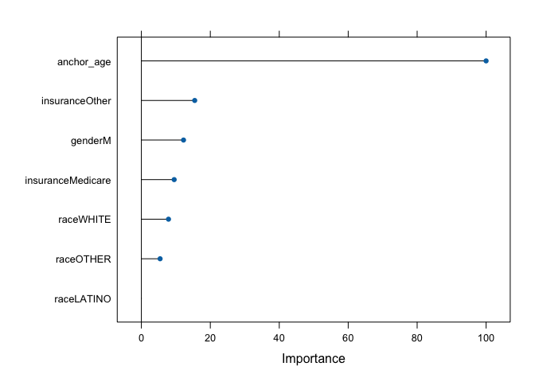
